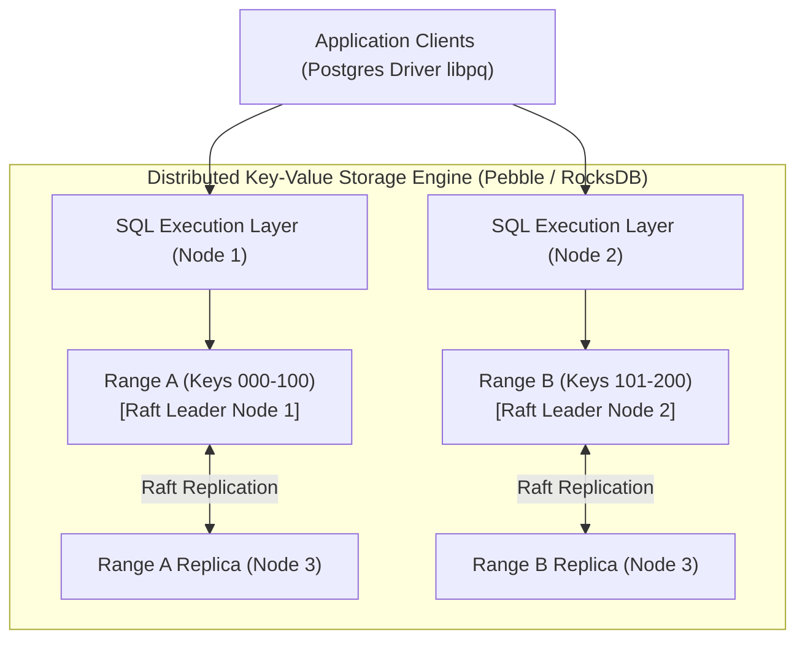
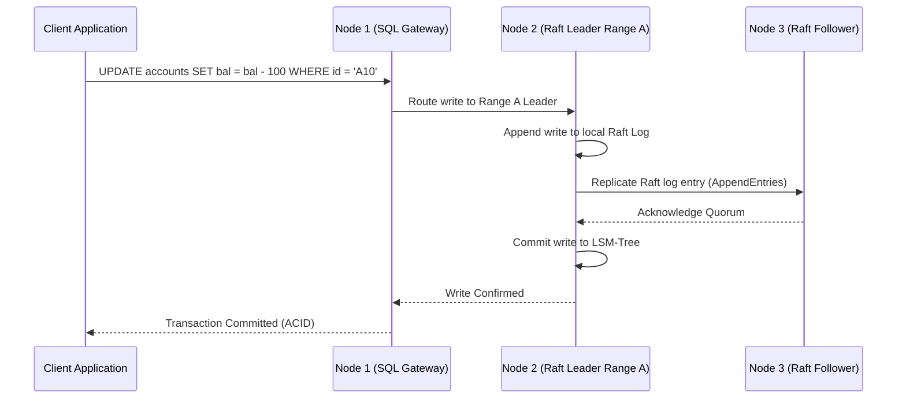

# Module 16: Distributed SQL Architecture — CockroachDB, YugabyteDB & Raft Consensus

**Standard Identifier:** `DOC-STD-UNIVERSAL-2026-SQL`
**Track:** Enterprise Relational Database Engineering, Distributed SQL & Performance Architecture
**Category:** Distributed Systems, Sharding & Multi-Region Consensus
**Status:** ✅ Completed

---

## 📑 Table of Contents

1. [High-Level Overview & Executive Summary](#1-high-level-overview--executive-summary)

2. [The Distributed SQL Paradigm: NoSQL Scale with Full ACID SQL](#2-the-distributed-sql-paradigm-nosql-scale-with-full-acid-sql)

3. [Raft Consensus Groups & Range-Based Automatic Sharding](#3-raft-consensus-groups--range-based-automatic-sharding)

4. [Distributed Two-Phase Commits (2PC) & Spanner TrueTime Model](#4-distributed-two-phase-commits-2pc--spanner-truetime-model)

5. [Architectural Visual Topology](#5-architectural-visual-topology)

6. [Step-by-Step Production Lab: Local 3-Node CockroachDB Cluster](#6-step-by-step-production-lab-local-3-node-cockroachdb-cluster)

7. [Certification & Engineering Standards Cheat Sheet](#7-certification--engineering-standards-cheat-sheet)

8. [References (The 5+5 Rule)](#8-references-the-55-rule)

9. [Universal FinOps & Hardware Cost Governance](#9-universal-finops--hardware-cost-governance)

---

## 1. High-Level Overview & Executive Summary

Traditional single-node RDBMS engines (PostgreSQL, MySQL) scale vertically and require manual application-level sharding when storage or write throughput exceeds single-server boundaries. **Distributed SQL** architectures (CockroachDB, YugabyteDB, Google Cloud Spanner) provide standard PostgreSQL-compatible SQL query layers backed by distributed, horizontally partitioned key-value storage synchronized via the **Raft consensus algorithm** (Corbett et al., 2013).

### 👔 Executive Summary (For Managers & Non-Technical Stakeholders)

* **Business Purpose**: Delivers global multi-region database scaling and automated zero-downtime failover with full ACID transactional guarantees.
* **How It Works**: Automatically breaks tables into distributed ranges and replicates each range across multiple availability zones using the Raft consensus protocol.
* **Key Business Value & ROI**: Eliminates complex manual database sharding maintenance while surviving entire cloud data center outages with zero data loss ($RPO=0, RTO < 3s$).

---

## 2. The Distributed SQL Paradigm: NoSQL Scale with Full ACID SQL



---

## 3. Raft Consensus Groups & Range-Based Automatic Sharding

Tables are ordered by primary key and split into contiguous 64MB **Ranges**. Each range forms an independent Raft consensus group with 3 or 5 replicas distributed across distinct failure zones (Ongaro & Ousterhout, 2014).

---

## 4. Distributed Two-Phase Commits (2PC) & Spanner TrueTime Model

When a transaction mutates keys spanning multiple independent ranges, the coordinator node executes a Distributed Two-Phase Commit protocol with Hybrid Logical Clocks (HLC) to guarantee strict serializable isolation.

---

## 5. Architectural Visual Topology



---

## 6. Step-by-Step Production Lab: Local 3-Node CockroachDB Cluster

```bash

# Step 1: Launch 3-node CockroachDB cluster using Docker
docker network create roachnet

docker run -d --name roach1 --net roachnet -p 26257:26257 -p 8080:8080     cockroachdb/cockroach:latest start --insecure --join=roach1,roach2,roach3

docker run -d --name roach2 --net roachnet     cockroachdb/cockroach:latest start --insecure --join=roach1,roach2,roach3

docker run -d --name roach3 --net roachnet     cockroachdb/cockroach:latest start --insecure --join=roach1,roach2,roach3

# Step 2: Initialize cluster
docker exec -i roach1 ./cockroach init --insecure

# Step 3: Connect via standard psql client
docker exec -i roach1 ./cockroach sql --insecure -e     "CREATE TABLE geo_users (id UUID PRIMARY KEY DEFAULT gen_random_uuid(), region STRING, name STRING); INSERT INTO geo_users (region, name) VALUES ('us-east', 'Alice'), ('eu-west', 'Bob'); SELECT * FROM geo_users;"

# Clean up
docker stop roach1 roach2 roach3 && docker rm roach1 roach2 roach3 && docker network rm roachnet
```

---

## 7. Certification & Engineering Standards Cheat Sheet

| Metric / Concept | Standard Rule |
| :--- | :--- |
| **Quorum Formula** | Majority required: Q = floor(N/2) + 1 (2 of 3 nodes, 3 of 5 nodes). |
| **Survival Guarantee** | A 3-node cluster survives 1 node death; 5-node cluster survives 2 node deaths. |

---

## 8. References (The 5+5 Rule)

1. Corbett, J. C. et al. (2013). Spanner: Google's globally distributed database. *ACM Transactions on Computer Systems*, 31(3), 1-22.
2. Ongaro, D., & Ousterhout, J. (2014). In search of an understandable consensus algorithm (Raft). *USENIX ATC*.
3. CockroachDB Authors. (2024). *CockroachDB architecture and design*. Cockroach Labs.
4. YugabyteDB Community. (2024). *YugabyteDB distributed SQL architecture*.
5. Kleppmann, M. (2017). *Designing data-intensive applications*. O'Reilly Media.
6. Silberschatz, A. et al. (2020). *Database system concepts*.
7. Date, C. J. (2019). *Database design and relational theory*.
8. Stonebraker, M. (2010). *SQL databases vs NoSQL databases*.
9. Garcia-Molina, H. et al. (2008). *Database systems: The complete book*.
10. Celko, J. (2014). *SQL for smarties*.

---

## 9. Universal FinOps & Hardware Cost Governance

| Optimization Strategy | Mechanism | FinOps Cloud Impact |
| :--- | :--- | :--- |
| **Multi-Region Survival** | Automatic Raft failover without standbys | Eliminates idle cold standby database licensing and compute fees |
| **Locality-Aware Routing** | Keep European user data in EU availability zones | Eliminates international cross-region data transfer bandwidth bills |
