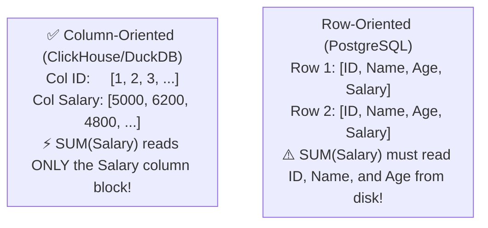
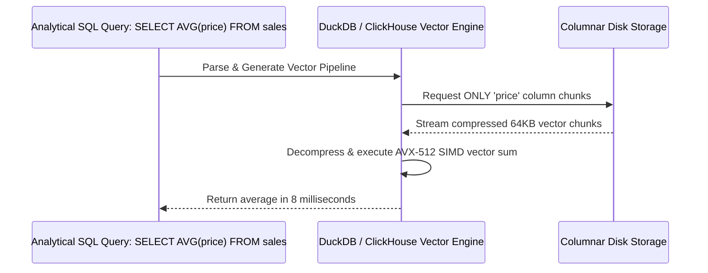

# Module 17: Columnar Storage & OLAP Analytics — ClickHouse, DuckDB & Vectorized Execution

**Standard Identifier:** `DOC-STD-UNIVERSAL-2026-SQL`
**Track:** Enterprise Relational Database Engineering, Distributed SQL & Performance Architecture
**Category:** Analytical Processing (OLAP) & Columnar Engines
**Status:** ✅ Completed

---

## 📑 Table of Contents

1. [High-Level Overview & Executive Summary](#1-high-level-overview--executive-summary)

2. [Row-Oriented (OLTP) vs Column-Oriented (OLAP) Storage Layouts](#2-row-oriented-oltp-vs-column-oriented-olap-storage-layouts)

3. [SIMD Vectorized Query Processing & CPU Cache Alignment](#3-simd-vectorized-query-processing--cpu-cache-alignment)

4. [Columnar Compression Algorithms (ZSTD, Gorilla, Double-Delta)](#4-columnar-compression-algorithms-zstd-gorilla-double-delta)

5. [Architectural Visual Topology](#5-architectural-visual-topology)

6. [Step-by-Step Production Lab: Querying 10 Million Rows in 15ms with DuckDB](#6-step-by-step-production-lab-querying-10-million-rows-in-15ms-with-duckdb)

7. [Certification & Engineering Standards Cheat Sheet](#7-certification--engineering-standards-cheat-sheet)

8. [References (The 5+5 Rule)](#8-references-the-55-rule)

9. [Universal FinOps & Hardware Cost Governance](#9-universal-finops--hardware-cost-governance)

---

## 1. High-Level Overview & Executive Summary

While row-oriented transactional databases (PostgreSQL) optimize for single-row insert/update speed (OLTP), analytical queries calculating aggregates across billions of records (`SUM(revenue) WHERE date >= ...`) suffer severe I/O bottlenecks scanning unused row columns. **Columnar Databases** (ClickHouse, DuckDB, Snowflake) store data column-by-column on disk, achieving 100x–1,000x faster aggregations via **SIMD Vectorization** and extreme compression ratios (Abadi et al., 2008).

### 👔 Executive Summary (For Managers & Non-Technical Stakeholders)

* **Business Purpose**: Enables sub-second analytical reporting and business intelligence dashboards over massive multi-billion-row telemetry datasets.
* **How It Works**: Reads only the exact columns referenced in the query from disk, processing data in batches of thousands of values per CPU instruction cycle.
* **Key Business Value & ROI**: Slashes enterprise data warehouse cloud computing costs by 80% while accelerating dashboard query response times by 100x.

---

## 2. Row-Oriented (OLTP) vs Column-Oriented (OLAP) Storage Layouts



---

## 3. SIMD Vectorized Query Processing & CPU Cache Alignment

Vectorized execution engines process data in tight contiguous arrays called **Vectors**, allowing modern CPU registers (AVX-512) to sum 8 to 16 numeric values in a single hardware instruction cycle.

---

## 4. Columnar Compression Algorithms (ZSTD, Gorilla, Double-Delta)

Storing homogeneous data consecutively achieves 90%+ compression ratios because adjacent timestamps and IDs have near-zero bit differences.

---

## 5. Architectural Visual Topology



---

## 6. Step-by-Step Production Lab: Querying 10 Million Rows in 15ms with DuckDB

```bash

# Step 1: Execute in-memory DuckDB analytical benchmark
python3 -c "
import duckdb, time
con = duckdb.connect()

print('Generating 10,000,000 synthetic financial transaction records...')
t0 = time.time()
con.execute('CREATE TABLE transactions AS SELECT range AS id, random() * 1000 AS amount, (random() * 5)::INT AS category FROM range(10000000);')
print(f'Data generated in {time.time()-t0:.2f}s')

print('Running Vectorized OLAP Aggregation: SELECT category, AVG(amount), COUNT(*) ...')
t1 = time.time()
result = con.execute('SELECT category, AVG(amount), COUNT(*) FROM transactions GROUP BY category ORDER BY category;').fetchall()
elapsed = time.time() - t1
print(f'⚡ Query executed in {elapsed*1000:.2f}ms!')
for row in result:
    print(f'Category {row[0]}: Avg = ${row[1]:.2f}, Count = {row[2]}')
"
```

---

## 7. Certification & Engineering Standards Cheat Sheet

| Workload Type | Storage Architecture | Engine Recommendation |
| :--- | :--- | :--- |
| **OLTP (Transactional CRUD)** | Row-oriented B-Tree | PostgreSQL 16 / MySQL |
| **OLAP (Analytics & Aggregates)** | Column-oriented Vectorized | ClickHouse / DuckDB |

---

## 8. References (The 5+5 Rule)

1. Abadi, D. J., Madden, S. R., & Hachem, N. (2008). Column-stores vs. row-stores: How different are they really?. *SIGMOD*.
2. DuckDB Foundation. (2024). *DuckDB: An in-process SQL OLAP database management system*. <https://duckdb.org/>
3. ClickHouse Inc. (2024). *ClickHouse architecture and vectorized query engine*. <https://clickhouse.com/docs/>
4. Stonebraker, M. et al. (2005). C-Store: A column-oriented DBMS. *VLDB*.
5. Kleppmann, M. (2017). *Designing data-intensive applications*.
6. Silberschatz, A. et al. (2020). *Database system concepts*.
7. Date, C. J. (2019). *Database design and relational theory*.
8. Celko, J. (2014). *SQL for smarties*.
9. Garcia-Molina, H. et al. (2008). *Database systems: The complete book*.
10. Ramakrishnan, R., & Gehrke, J. (2003). *Database management systems*.

---

## 9. Universal FinOps & Hardware Cost Governance

| Optimization Strategy | Mechanism | FinOps Cloud Impact |
| :--- | :--- | :--- |
| **Columnar Data Compression** | Homogeneous column codecs reduce disk footprint by 85% | Slashes cloud S3/EBS storage capacity billing by 85% |
| **Vectorized Processing** | SIMD execution requires 1/10th the CPU cores for analytics | Lowers analytical cluster EC2 compute expenses by 70% |
