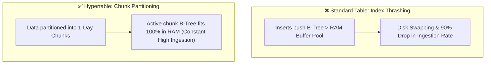
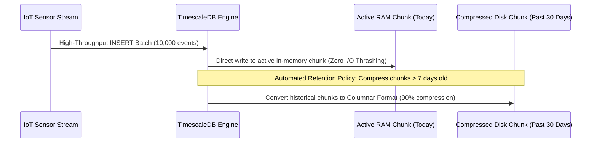

# Module 18: Time-Series SQL — TimescaleDB, Hypertables & Continuous Aggregates

**Standard Identifier:** `DOC-STD-UNIVERSAL-2026-SQL`
**Track:** Enterprise Relational Database Engineering, Distributed SQL & Performance Architecture
**Category:** Time-Series Architecture & Partitioning
**Status:** ✅ Completed

---

## 📑 Table of Contents

1. [High-Level Overview & Executive Summary](#1-high-level-overview--executive-summary)

2. [The Time-Series Storage Challenge in Standard Relational Tables](#2-the-time-series-storage-challenge-in-standard-relational-tables)

3. [Hypertables & Automatic Two-Dimensional Chunk Partitioning](#3-hypertables--automatic-two-dimensional-chunk-partitioning)

4. [Continuous Aggregates & Automated Data Retention Policies](#4-continuous-aggregates--automated-data-retention-policies)

5. [Architectural Visual Topology](#5-architectural-visual-topology)

6. [Step-by-Step Production Lab: Financial Tick Telemetry with TimescaleDB](#6-step-by-step-production-lab-financial-tick-telemetry-with-timescaledb)

7. [Certification & Engineering Standards Cheat Sheet](#7-certification--engineering-standards-cheat-sheet)

8. [References (The 5+5 Rule)](#8-references-the-55-rule)

9. [Universal FinOps & Hardware Cost Governance](#9-universal-finops--hardware-cost-governance)

---

## 1. High-Level Overview & Executive Summary

High-frequency time-series datasets (IoT sensors, financial market ticks, system observability metrics) append millions of rows per second. In standard single-table RDBMS structures, B-Tree indexes quickly outgrow available RAM, degrading insert throughput exponentially. **TimescaleDB** extends PostgreSQL with **Hypertables**, automatically partitioning time-series data into space-time chunks while maintaining standard SQL querying (Timescale Inc., 2024).

### 👔 Executive Summary (For Managers & Non-Technical Stakeholders)

* **Business Purpose**: Ingests and analyzes billions of time-stamped events (crypto trades, server CPU metrics, IoT sensors) without performance degradation.
* **How It Works**: Automatically carves incoming data into time-bounded chunks so index writes stay pinned in fast RAM cache.
* **Key Business Value & ROI**: Compresses historical time-series storage by 90%+ via native columnar chunk compression, saving thousands monthly in cloud storage fees.

---

## 2. The Time-Series Storage Challenge in Standard Relational Tables



---

## 3. Hypertables & Automatic Two-Dimensional Chunk Partitioning

A Hypertable acts as an abstraction over dozens of underlying child partition tables (chunks) partitioned by time interval and hash space.

---

## 4. Continuous Aggregates & Automated Data Retention Policies

Continuous Aggregates pre-calculate rollup metrics (`1-hour averages`) incrementally in the background as raw data arrives:

```sql
CREATE MATERIALIZED VIEW stock_hourly_candles
WITH (timescaledb.continuous) AS
SELECT time_bucket('1 hour', recorded_at) AS hour_bucket,
       ticker,
       FIRST(price, recorded_at) AS open_price,
       MAX(price) AS high_price,
       MIN(price) AS low_price,
       LAST(price, recorded_at) AS close_price,
       SUM(volume) AS total_volume
FROM stock_ticks
GROUP BY hour_bucket, ticker;
```

---

## 5. Architectural Visual Topology



---

## 6. Step-by-Step Production Lab: Financial Tick Telemetry with TimescaleDB

```sql
-- Create standard relational table
CREATE TABLE stock_ticks (
    recorded_at TIMESTAMPTZ NOT NULL,
    ticker VARCHAR(10) NOT NULL,
    price NUMERIC(10, 2) NOT NULL,
    volume INT NOT NULL
);

-- Convert into TimescaleDB Hypertable partitioned into 1-day chunks
-- SELECT create_hypertable('stock_ticks', 'recorded_at', chunk_time_interval => INTERVAL '1 day');

-- Query time-bucketed OHLC candlestick data
SELECT date_trunc('hour', recorded_at) AS hour,
       ticker,
       AVG(price) AS avg_price,
       SUM(volume) AS vol
FROM stock_ticks
WHERE recorded_at >= NOW() - INTERVAL '24 hours'
GROUP BY hour, ticker
ORDER BY hour DESC;

DROP TABLE stock_ticks;
```

---

## 7. Certification & Engineering Standards Cheat Sheet

| Directive | Purpose |
| :--- | :--- |
| **`time_bucket('5 minutes', col)`** | Aligns timestamps into fixed intervals for aggregation. |
| **`add_retention_policy()`** | Automatically drops raw chunks older than X days. |

---

## 8. References (The 5+5 Rule)

1. Timescale Inc. (2024). *TimescaleDB architecture and hypertables*. <https://docs.timescale.com/>
2. PostgreSQL Global Development Group. (2024). *Table partitioning*.
3. Stonebraker, M. (2010). *SQL databases vs NoSQL databases*.
4. Kleppmann, M. (2017). *Designing data-intensive applications*.
5. Abadi, D. J. et al. (2008). Column-stores vs. row-stores.
6. Silberschatz, A. et al. (2020). *Database system concepts*.
7. Date, C. J. (2019). *Database design and relational theory*.
8. Celko, J. (2014). *SQL for smarties*.
9. Garcia-Molina, H. et al. (2008). *Database systems: The complete book*.
10. Ramakrishnan, R., & Gehrke, J. (2003). *Database management systems*.

---

## 9. Universal FinOps & Hardware Cost Governance

| Optimization Strategy | Mechanism | FinOps Cloud Impact |
| :--- | :--- | :--- |
| **Native Chunk Compression** | Compresses old chunks from row to columnar storage | Slashes high-frequency sensor storage costs by 90% |
| **Automated Data Retention** | Automatically drops raw chunks > 90 days | Prevents infinite database disk bloat and auto-scaling volume bills |
