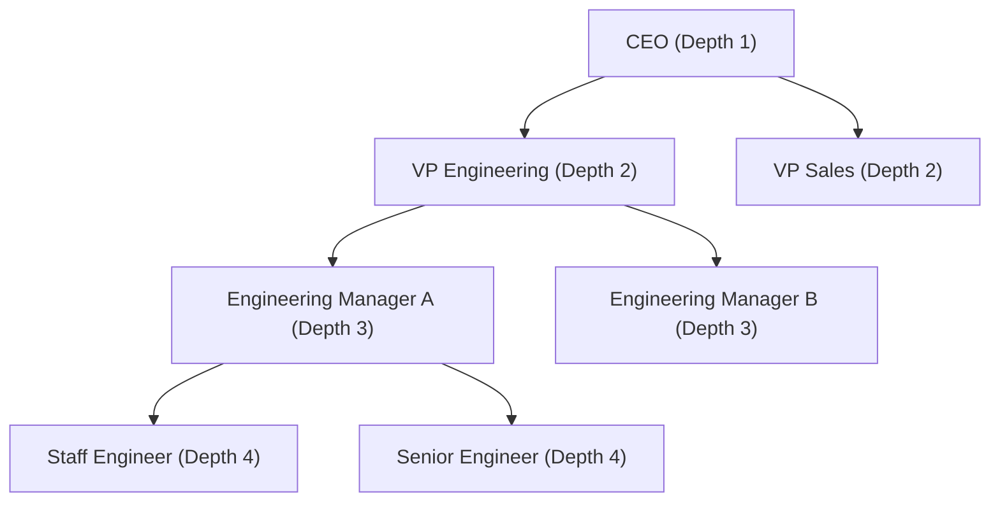

# Module 19: Graph & Hierarchical Data Modeling — Adjacency Lists, Nested Sets & Recursive CTEs

**Standard Identifier:** `DOC-STD-UNIVERSAL-2026-SQL`
**Track:** Enterprise Relational Database Engineering, Distributed SQL & Performance Architecture
**Category:** Advanced Relational Data Modeling & Graph Processing
**Status:** ✅ Completed

---

## 📑 Table of Contents

1. [High-Level Overview & Executive Summary](#1-high-level-overview--executive-summary)

2. [Hierarchical Data Patterns in Relational Engines](#2-hierarchical-data-patterns-in-relational-engines)

3. [Recursive Common Table Expressions (WITH RECURSIVE)](#3-recursive-common-table-expressions-with-recursive)

4. [Cycle Detection & Graph Path Traversal Algorithms](#4-cycle-detection--graph-path-traversal-algorithms)

5. [Architectural Visual Topology](#5-architectural-visual-topology)

6. [Step-by-Step Production Lab: Corporate Organizational Chart Traversal](#6-step-by-step-production-lab-corporate-organizational-chart-traversal)

7. [Certification & Engineering Standards Cheat Sheet](#7-certification--engineering-standards-cheat-sheet)

8. [References (The 5+5 Rule)](#8-references-the-55-rule)

9. [Universal FinOps & Hardware Cost Governance](#9-universal-finops--hardware-cost-governance)

---

## 1. High-Level Overview & Executive Summary

Modeling graph structures (organizational management trees, bill-of-materials, social networks, dependency graphs) in relational databases requires traversing recursive parent-child relationships. Using **ANSI SQL `WITH RECURSIVE` CTEs**, relational engines execute iterative breadth-first and depth-first tree traversals entirely within the database kernel (Celko, 2012).

### 👔 Executive Summary (For Managers & Non-Technical Stakeholders)

* **Business Purpose**: Models complex hierarchical business structures (multi-level reporting hierarchies, product category trees, fraud rings) without dedicated graph databases.
* **How It Works**: Executes iterative SQL recursion to traverse infinite-depth parent-child trees in a single database roundtrip.
* **Key Business Value & ROI**: Avoids paying for dedicated Neo4j graph database licenses and complex ETL synchronization pipelines.

---

## 2. Hierarchical Data Patterns in Relational Engines

| Modeling Pattern | Read Performance | Insert/Update Cost | Tree Traversal Mechanism |
| :--- | :--- | :--- | :--- |
| **Adjacency List** | Medium | Low ($O(1)$) | Recursive CTE (`WITH RECURSIVE`) |
| **Materialized Path** | High | Medium ($O(N)$) | String prefix matching (`path LIKE '1.4.%'`) |
| **Nested Sets** | Ultra-High | High (Relabeling required) | Range query (`BETWEEN lft AND rgt`) |

---

## 3. Recursive Common Table Expressions (WITH RECURSIVE)

```sql
WITH RECURSIVE OrgChart AS (
    -- Non-Recursive Anchor Member: Find CEO (top of tree)
    SELECT id, name, manager_id, 1 AS depth
    FROM employees
    WHERE manager_id IS NULL

    UNION ALL

    -- Recursive Member: Join children to previous level
    SELECT e.id, e.name, e.manager_id, o.depth + 1
    FROM employees e
    INNER JOIN OrgChart o ON e.manager_id = o.id
)
SELECT * FROM OrgChart ORDER BY depth, name;
```

---

## 4. Cycle Detection & Graph Path Traversal Algorithms

To prevent infinite loops when data contains circular references ($A  o B  o C  o A$), track visited node IDs in an array:

```sql
WHERE NOT e.id = ANY(o.visited_path)
```

---

## 5. Architectural Visual Topology



---

## 6. Step-by-Step Production Lab: Corporate Organizational Chart Traversal

```sql
-- Create hierarchical lab table
CREATE TEMP TABLE employees_tree (
    id serial PRIMARY KEY,
    name text NOT NULL,
    manager_id int REFERENCES employees_tree(id)
);

INSERT INTO employees_tree (id, name, manager_id) VALUES
    (1, 'Alice (CEO)', NULL),
    (2, 'Bob (VP Eng)', 1),
    (3, 'Charlie (VP Sales)', 1),
    (4, 'David (Lead Dev)', 2),
    (5, 'Eve (Senior Dev)', 4);

-- Traverse full management tree calculating hierarchy depth and breadcrumbs
WITH RECURSIVE Org_Hierarchy AS (
    SELECT id, name, manager_id, 1 AS level, ARRAY[name] AS path_breadcrumb
    FROM employees_tree
    WHERE manager_id IS NULL
    UNION ALL
    SELECT e.id, e.name, e.manager_id, h.level + 1, h.path_breadcrumb || e.name
    FROM employees_tree e
    JOIN Org_Hierarchy h ON e.manager_id = h.id
)
SELECT level, array_to_string(path_breadcrumb, ' -> ') AS hierarchy_path
FROM Org_Hierarchy
ORDER BY level;

DROP TABLE employees_tree;
```

---

## 7. Certification & Engineering Standards Cheat Sheet

| Syntax Element | Rule |
| :--- | :--- |
| **`UNION ALL`** | Mandatory in recursive CTEs to prevent duplicate hashing overhead. |
| **`CYCLE clause`** | SQL:2008 standard cycle detection clause (`CYCLE id SET is_cycle USING path`). |

---

## 8. References (The 5+5 Rule)

1. Celko, J. (2012). *Joe Celko's trees and hierarchies in SQL for smarties* (2nd ed.). Morgan Kaufmann.
2. PostgreSQL Global Development Group. (2024). *WITH queries (Common Table Expressions)*.
3. ISO/IEC. (2016). *SQL database language standard*.
4. Date, C. J. (2019). *Database design and relational theory*.
5. Silberschatz, A. et al. (2020). *Database system concepts*.
6. Kleppmann, M. (2017). *Designing data-intensive applications*.
7. Garcia-Molina, H. et al. (2008). *Database systems: The complete book*.
8. Celko, J. (2014). *SQL for smarties*.
9. Ramakrishnan, R., & Gehrke, J. (2003). *Database management systems*.
10. Stonebraker, M. (2005). *Readings in database systems*.

---

## 9. Universal FinOps & Hardware Cost Governance

| Optimization Strategy | Mechanism | FinOps Cloud Impact |
| :--- | :--- | :--- |
| **SQL Graph Recursion** | Replaces external graph databases with PostgreSQL | Saves $2,500/mo in dedicated graph DB hosting costs |
| **Single-Query Tree Resolution** | Eliminates N+1 recursive API queries from backend | Drops backend-to-database network packet chattiness by 95% |
