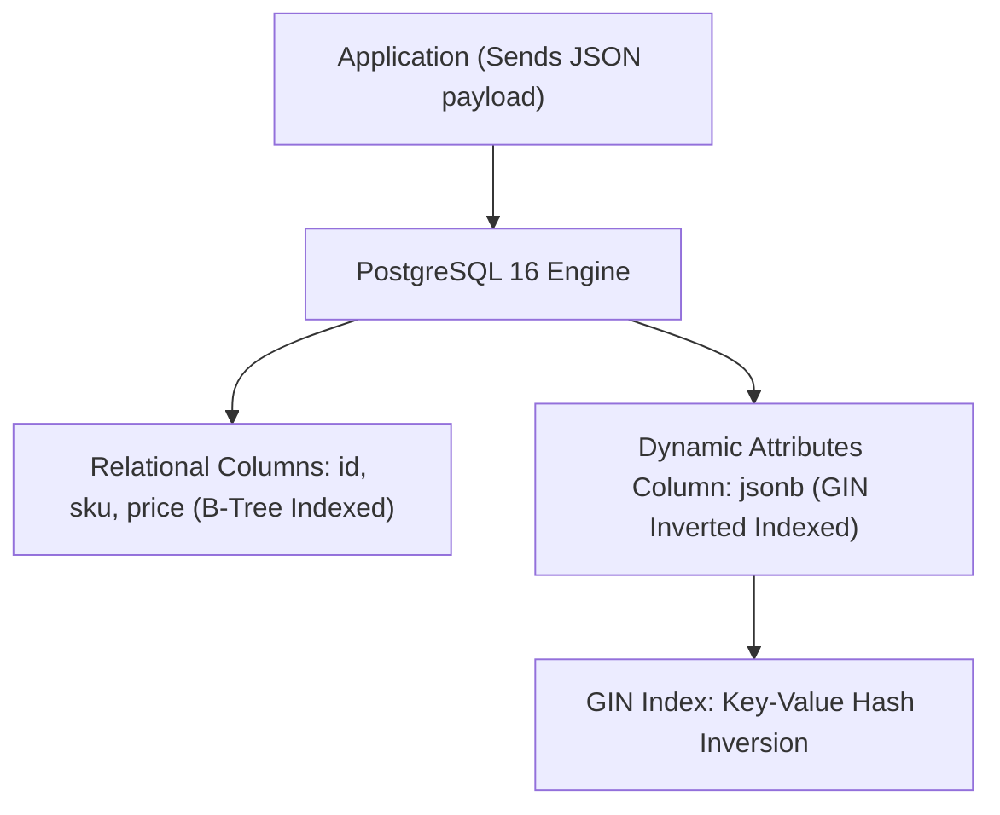

# Module 20: Hybrid Relational-Document Architecture — JSONB, GIN Indexing & Schema-on-Read

**Standard Identifier:** `DOC-STD-UNIVERSAL-2026-SQL`
**Track:** Enterprise Relational Database Engineering, Distributed SQL & Performance Architecture
**Category:** Document Store Integration & Semi-Structured Data
**Status:** ✅ Completed

---

## 📑 Table of Contents

1. [High-Level Overview & Executive Summary](#1-high-level-overview--executive-summary)

2. [The Semi-Structured Data Dilemma: JSON vs JSONB](#2-the-semi-structured-data-dilemma-json-vs-jsonb)

3. [JSON Path Operators (`->`, `->>`, `#>`, `jsonpath`)](#3-json-path-operators------jsonpath)

4. [Generalized Inverted Indexing (GIN) for Sub-Millisecond JSON Queries](#4-generalized-inverted-indexing-gin-for-sub-millisecond-json-queries)

5. [Architectural Visual Topology](#5-architectural-visual-topology)

6. [Step-by-Step Production Lab: E-Commerce Dynamic Attribute Filtering](#6-step-by-step-production-lab-e-commerce-dynamic-attribute-filtering)

7. [Certification & Engineering Standards Cheat Sheet](#7-certification--engineering-standards-cheat-sheet)

8. [References (The 5+5 Rule)](#8-references-the-55-rule)

9. [Universal FinOps & Hardware Cost Governance](#9-universal-finops--hardware-cost-governance)

---

## 1. High-Level Overview & Executive Summary

Enterprise systems frequently process polymorphic, rapidly evolving attributes (custom user settings, third-party webhook payloads, dynamic product specifications). Attempting to model these in rigid relational tables leads to anti-patterns like Entity-Attribute-Value (EAV). PostgreSQL provides **`JSONB`**, a decomposed binary JSON storage format that supports full ACID transactions, query operators, and **GIN (Generalized Inverted Index)** acceleration (PostgreSQL Community, 2024).

### 👔 Executive Summary (For Managers & Non-Technical Stakeholders)

* **Business Purpose**: Enables MongoDB-style dynamic document storage while maintaining PostgreSQL ACID transactions and relational joins.
* **How It Works**: Converts text JSON into an indexed binary tree format in memory, indexing nested document keys with GIN indexes.
* **Key Business Value & ROI**: Eliminates the operational cost and architectural complexity of running dual database clusters (e.g. Postgres + Mongo).

---

## 2. The Semi-Structured Data Dilemma: JSON vs JSONB

* **`JSON`**: Stores exact text representation (preserves whitespace and key order); slow to query because text must be re-parsed on every access.
* **`JSONB`**: Stores decomposed binary format; strips redundant whitespace, deduplicates keys, and enables **GIN indexing** for microsecond lookups.

---

## 3. JSON Path Operators (`->`, `->>`, `#>`, `jsonpath`)

* `data->'key'`: Returns JSON element (as `jsonb`).
* `data->>'key'`: Returns scalar value (as text).
* `data @> '{"status": "active"}'`: JSON containment operator (accelerated by GIN index).

---

## 4. Generalized Inverted Indexing (GIN) for Sub-Millisecond JSON Queries

```sql
-- Create GIN index on entire JSONB document
CREATE INDEX idx_products_attributes_gin ON products USING gin (attributes);
```

---

## 5. Architectural Visual Topology



---

## 6. Step-by-Step Production Lab: E-Commerce Dynamic Attribute Filtering

```sql
CREATE TEMP TABLE product_catalog (
    id serial PRIMARY KEY,
    title text NOT NULL,
    specs jsonb NOT NULL
);

INSERT INTO product_catalog (title, specs) VALUES
    ('Gaming Laptop', '{"cpu": "Intel i9", "ram_gb": 32, "gpu": "RTX 4080", "tags": ["gaming", "pro"]}'),
    ('Ultrabook', '{"cpu": "Apple M3", "ram_gb": 16, "screen": "13-inch", "tags": ["portable"]}');

-- Query using JSON containment operator @> (Uses GIN index!)
SELECT title, specs->>'cpu' AS cpu_model
FROM product_catalog
WHERE specs @> '{"ram_gb": 32}';

DROP TABLE product_catalog;
```

---

## 7. Certification & Engineering Standards Cheat Sheet

| Operator | Return Type | Index Support |
| :--- | :--- | :--- |
| `->>` | `text` | Expression B-Tree Index |
| `@>` | `boolean` | GIN Inverted Index |
| `?` | `boolean` (Key existence) | GIN Inverted Index |

---

## 8. References (The 5+5 Rule)

1. PostgreSQL Global Development Group. (2024). *JSON functions and operators*. <https://www.postgresql.org/docs/16/functions-json.html>
2. ISO/IEC. (2016). *SQL/JSON features in SQL:2016 standard*.
3. Stonebraker, M. (2010). *SQL databases vs NoSQL databases*.
4. Kleppmann, M. (2017). *Designing data-intensive applications*.
5. Date, C. J. (2019). *Database design and relational theory*.
6. Silberschatz, A. et al. (2020). *Database system concepts*.
7. Celko, J. (2014). *SQL for smarties*.
8. Garcia-Molina, H. et al. (2008). *Database systems: The complete book*.
9. Ramakrishnan, R., & Gehrke, J. (2003). *Database management systems*.
10. Abadi, D. J. et al. (2008). *Column-stores vs. row-stores*.

---

## 9. Universal FinOps & Hardware Cost Governance

| Optimization Strategy | Mechanism | FinOps Cloud Impact |
| :--- | :--- | :--- |
| **PostgreSQL JSONB over MongoDB** | Consolidates document and relational workloads in one database | Saves $1,800/mo in dedicated MongoDB Atlas cluster hosting fees |
| **GIN Index Containment** | Avoids sequential JSON text scanning | Drops database CPU utilization by 75% on dynamic search queries |
