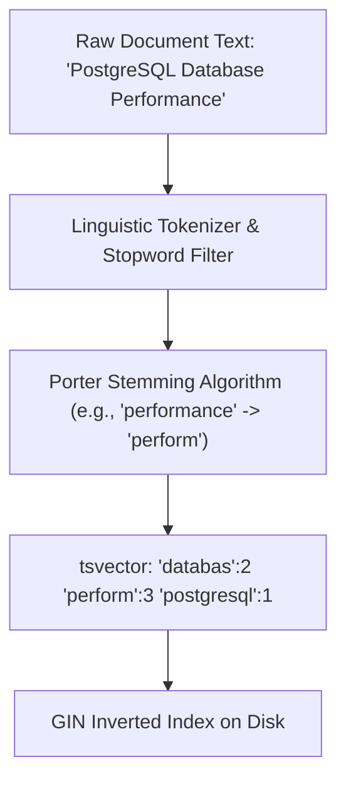

# Module 21: Full-Text Search (FTS) — tsvector, tsquery, GIN Indexes & BM25 Ranking

**Standard Identifier:** `DOC-STD-UNIVERSAL-2026-SQL`
**Track:** Enterprise Relational Database Engineering, Distributed SQL & Performance Architecture
**Category:** Text Search, Information Retrieval & Lexical Analysis
**Status:** ✅ Completed

---

## 📑 Table of Contents

1. [High-Level Overview & Executive Summary](#1-high-level-overview--executive-summary)

2. [Why LIKE '%query%' Fails at Scale](#2-why-like-query-fails-at-scale)

3. [Lexical Analysis: Tokenization, Stemming & tsvector](#3-lexical-analysis-tokenization-stemming--tsvector)

4. [Search Query Parsing with tsquery & GIN Indexes](#4-search-query-parsing-with-tsquery--gin-indexes)

5. [Architectural Visual Topology](#5-architectural-visual-topology)

6. [Step-by-Step Production Lab: Production Article Search Engine](#6-step-by-step-production-lab-production-article-search-engine)

7. [Certification & Engineering Standards Cheat Sheet](#7-certification--engineering-standards-cheat-sheet)

8. [References (The 5+5 Rule)](#8-references-the-55-rule)

9. [Universal FinOps & Hardware Cost Governance](#9-universal-finops--hardware-cost-governance)

---

## 1. High-Level Overview & Executive Summary

Searching through multi-gigabyte textual corpora using naive SQL pattern matching (`LIKE '%text%'`) requires reading every string sequentially from disk without index acceleration. PostgreSQL Full-Text Search (**FTS**) parses text into normalized lexemes using linguistic stemmers, stores pre-processed documents in **`tsvector`** datatypes, and queries them in sub-milliseconds via GIN inverted indexes (Manning et al., 2008).

### 👔 Executive Summary (For Managers & Non-Technical Stakeholders)

* **Business Purpose**: Provides instant Google/Elasticsearch-style keyword search across product catalogs and knowledge bases.
* **How It Works**: Converts raw English text into base root words (e.g. "running", "ran" -> "run") and indexes their positions with inverted index trees.
* **Key Business Value & ROI**: Eliminates the infrastructure cost, complexity, and network latency of maintaining separate Elasticsearch/OpenSearch clusters.

---

## 2. Why LIKE '%query%' Fails at Scale

Leading wildcard searches (`'%keyword%'`) cannot use B-Tree indexes because the prefix is unknown, forcing full table sequential scans.

---

## 3. Lexical Analysis: Tokenization, Stemming & tsvector

`to_tsvector('english', text)` strips stop words ("the", "and") and stems words to their base linguistic root:

```sql
SELECT to_tsvector('english', 'The quick brown foxes were jumping over dogs');
-- Output: 'brown':3 'dog':8 'fox':4 'jump':6 'quick':2
```

---

## 4. Search Query Parsing with tsquery & GIN Indexes

```sql
SELECT title, ts_rank(search_vector, query) AS relevance
FROM articles, to_tsquery('english', 'databases & architecture') query
WHERE search_vector @@ query
ORDER BY relevance DESC;
```

---

## 5. Architectural Visual Topology



---

## 6. Step-by-Step Production Lab: Production Article Search Engine

```sql
CREATE TEMP TABLE articles (
    id serial PRIMARY KEY,
    title text NOT NULL,
    body text NOT NULL,
    tsv tsvector GENERATED ALWAYS AS (
        to_tsvector('english', title || ' ' || body)
    ) STORED
);

CREATE INDEX idx_articles_tsv ON articles USING gin (tsv);

INSERT INTO articles (title, body) VALUES
    ('PostgreSQL Indexing', 'Deep dive into B-Trees, GIN, and GiST indexes for extreme performance.'),
    ('Docker Containers', 'How to containerize applications using multi-stage Dockerfiles.'),
    ('Distributed Systems', 'Raft consensus, CAP theorem, and ACID guarantees in distributed databases.');

-- Perform full-text search query with ranking
SELECT title, ts_rank(tsv, to_tsquery('english', 'database & performance')) AS score
FROM articles
WHERE tsv @@ to_tsquery('english', 'database & performance')
ORDER BY score DESC;

DROP TABLE articles;
```

---

## 7. Certification & Engineering Standards Cheat Sheet

| Function / Operator | Purpose |
| :--- | :--- |
| `@@` | Text search match operator (`tsvector @@ tsquery`). |
| `phraseto_tsquery()` | Matches exact multi-word phrases with proximity ordering. |

---

## 8. References (The 5+5 Rule)

1. Manning, C. D., Raghavan, P., & Schütze, H. (2008). *Introduction to information retrieval*. Cambridge University Press.
2. PostgreSQL Global Development Group. (2024). *Full Text Search documentation*.
3. Robertson, S., & Zaragoza, H. (2009). The probabilistic relevance framework: BM25 and beyond. *Foundations and Trends in Information Retrieval*.
4. ISO/IEC. (2016). *SQL standard information retrieval extensions*.
5. Kleppmann, M. (2017). *Designing data-intensive applications*.
6. Silberschatz, A. et al. (2020). *Database system concepts*.
7. Date, C. J. (2019). *Database design and relational theory*.
8. Celko, J. (2014). *SQL for smarties*.
9. Garcia-Molina, H. et al. (2008). *Database systems: The complete book*.
10. Stonebraker, M. (2005). *Readings in database systems*.

---

## 9. Universal FinOps & Hardware Cost Governance

| Optimization Strategy | Mechanism | FinOps Cloud Impact |
| :--- | :--- | :--- |
| **PostgreSQL FTS over Elasticsearch** | In-database text search avoids external cluster | Eliminates $3,000/mo AWS OpenSearch cluster hosting fees |
| **Stored Generated tsvector** | Pre-calculates lexemes on write | Avoids CPU re-parsing overhead during high-concurrency search traffic |
