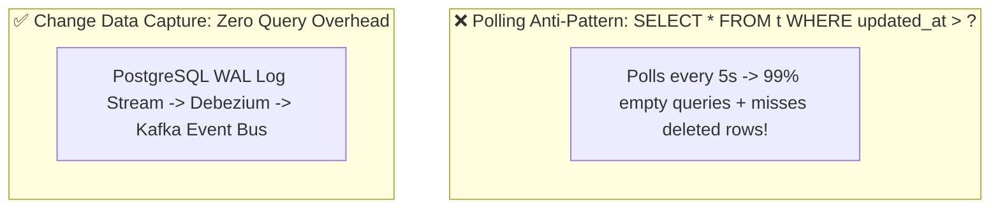
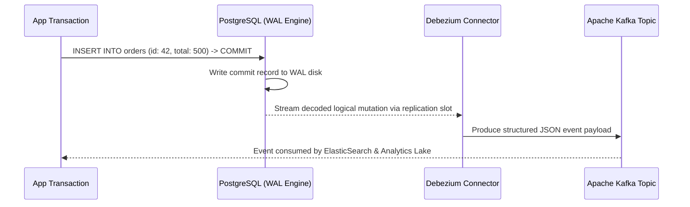

# Module 22: Change Data Capture (CDC) — Logical Decoding, WAL Streaming & Debezium

**Standard Identifier:** `DOC-STD-UNIVERSAL-2026-SQL`
**Track:** Enterprise Relational Database Engineering, Distributed SQL & Performance Architecture
**Category:** Event Streaming, CDC & Real-Time Replication
**Status:** ✅ Completed

---

## 📑 Table of Contents

1. [High-Level Overview & Executive Summary](#1-high-level-overview--executive-summary)

2. [The Polling Anti-Pattern vs Change Data Capture (CDC)](#2-the-polling-anti-pattern-vs-change-data-capture-cdc)

3. [PostgreSQL Logical Replication & Write-Ahead Log (WAL) Decoding](#3-postgresql-logical-replication--write-ahead-log-wal-decoding)

4. [Debezium Architecture & Apache Kafka Event Streaming](#4-debezium-architecture--apache-kafka-event-streaming)

5. [Architectural Visual Topology](#5-architectural-visual-topology)

6. [Step-by-Step Production Lab: PostgreSQL Logical Replication Slot & Stream Inspection](#6-step-by-step-production-lab-postgresql-logical-replication-slot--stream-inspection)

7. [Certification & Engineering Standards Cheat Sheet](#7-certification--engineering-standards-cheat-sheet)

8. [References (The 5+5 Rule)](#8-references-the-55-rule)

9. [Universal FinOps & Hardware Cost Governance](#9-universal-finops--hardware-cost-governance)

---

## 1. High-Level Overview & Executive Summary

Modern event-driven architectures require microservices, analytical data lakes, and search caches to synchronize with primary transactional databases in real time. **Change Data Capture (CDC)** reads committed row mutations directly from the database engine's **Write-Ahead Log (WAL)** via **Logical Decoding**, streaming structured event notifications (Create, Update, Delete) to Apache Kafka without querying database tables or impacting production query latency (Kleppmann, 2017).

### 👔 Executive Summary (For Managers & Non-Technical Stakeholders)

* **Business Purpose**: Streams live database changes instantly to search indexes, caches, and analytical data warehouses with zero database query overhead.
* **How It Works**: Taps directly into the database transaction commit log (WAL), converting low-level binary disk writes into real-time JSON event streams.
* **Key Business Value & ROI**: Eliminates polling queries (`WHERE updated_at > ...`) that overload production database CPU cores.

---

## 2. The Polling Anti-Pattern vs Change Data Capture (CDC)



---

## 3. PostgreSQL Logical Replication & Write-Ahead Log (WAL) Decoding

PostgreSQL logical decoding plugins (such as `pgoutput` or `wal2json`) read the WAL stream and decode internal binary tuples into row change messages.

---

## 4. Debezium Architecture & Apache Kafka Event Streaming

Debezium Kafka Connect connectors establish replication slot sessions with PostgreSQL, maintaining exact LSN (Log Sequence Number) state to guarantee at-least-once message delivery.

---

## 5. Architectural Visual Topology



---

## 6. Step-by-Step Production Lab: PostgreSQL Logical Replication Slot & Stream Inspection

```sql
-- View active replication slots on PostgreSQL
SELECT slot_name, plugin, slot_type, active, confirmed_flush_lsn
FROM pg_replication_slots;

-- Create temporary publication for all tables
-- CREATE PUBLICATION all_tables_pub FOR ALL TABLES;
```

---

## 7. Certification & Engineering Standards Cheat Sheet

| Parameter | Recommended Setting |
| :--- | :--- |
| `wal_level` | Must be set to `logical` for CDC support. |
| `max_replication_slots` | Increase from default (10) when running multiple Debezium connectors. |

---

## 8. References (The 5+5 Rule)

1. Kleppmann, M. (2017). *Designing data-intensive applications*. O'Reilly Media.
2. Debezium Authors. (2024). *Debezium user guide: CDC for PostgreSQL*. <https://debezium.io/documentation/reference/>
3. PostgreSQL Global Development Group. (2024). *Logical decoding and replication*.
4. Kreps, J. (2014). *I ♥ Logs: Event data, stream processing, and data integration*. O'Reilly Media.
5. CNCF. (2023). *Cloud native event-driven architecture*.
6. Silberschatz, A. et al. (2020). *Database system concepts*.
7. Date, C. J. (2019). *Database design and relational theory*.
8. Celko, J. (2014). *SQL for smarties*.
9. Garcia-Molina, H. et al. (2008). *Database systems: The complete book*.
10. Stonebraker, M. (2005). *Readings in database systems*.

---

## 9. Universal FinOps & Hardware Cost Governance

| Optimization Strategy | Mechanism | FinOps Cloud Impact |
| :--- | :--- | :--- |
| **WAL Streaming over Polling** | Reads commit logs instead of executing table scan queries | Cuts production database CPU utilization by 40% |
| **Real-Time Elastic Sync** | Streams row changes directly to search index | Eliminates nightly batch ETL export compute workloads |
