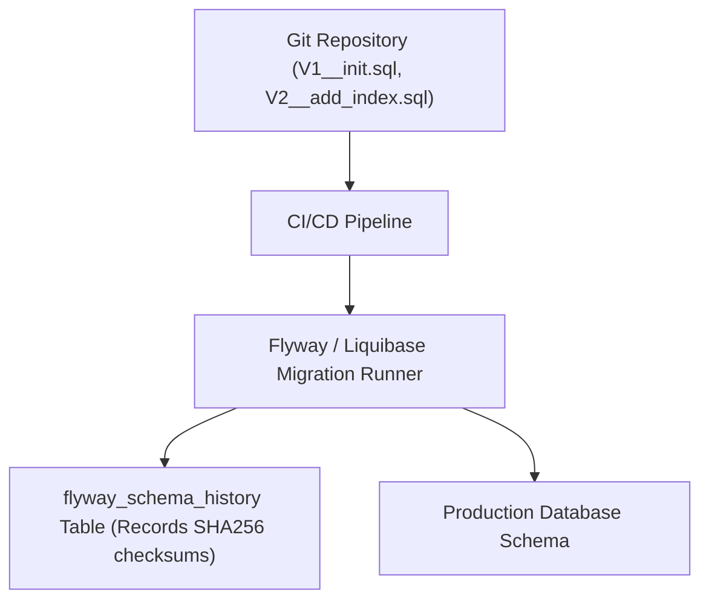
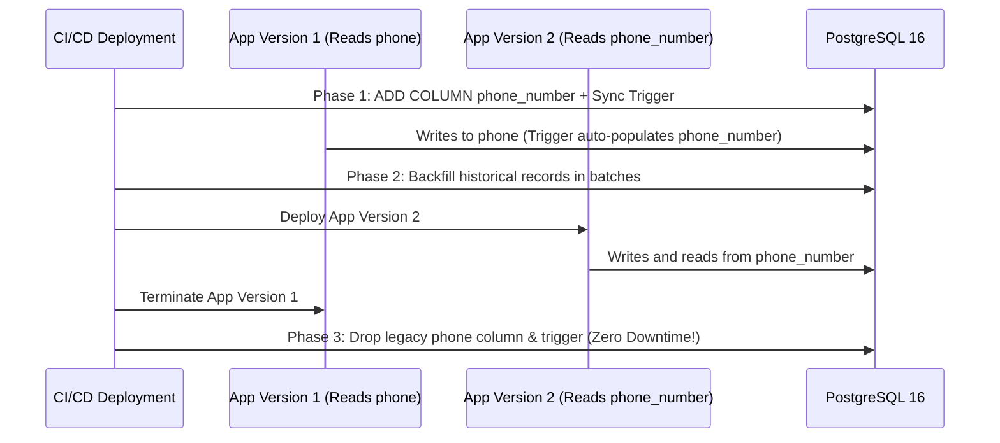

# Module 23: Database Schema Migrations — Flyway, Liquibase & Zero-Downtime Blue/Green Patterns

**Standard Identifier:** `DOC-STD-UNIVERSAL-2026-SQL`
**Track:** Enterprise Relational Database Engineering, Distributed SQL & Performance Architecture
**Category:** Schema Version Control & Zero-Downtime DevOps
**Status:** ✅ Completed

---

## 📑 Table of Contents

1. [High-Level Overview & Executive Summary](#1-high-level-overview--executive-summary)

2. [The Schema Evolution Problem & Version Control](#2-the-schema-evolution-problem--version-control)

3. [Flyway vs Liquibase: Declarative vs Imperative Migrations](#3-flyway-vs-liquibase-declarative-vs-imperative-migrations)

4. [The Expand and Contract Pattern for Zero-Downtime Deployments](#4-the-expand-and-contract-pattern-for-zero-downtime-deployments)

5. [Architectural Visual Topology](#5-architectural-visual-topology)

6. [Step-by-Step Production Lab: Zero-Downtime Column Rename Migration](#6-step-by-step-production-lab-zero-downtime-column-rename-migration)

7. [Certification & Engineering Standards Cheat Sheet](#7-certification--engineering-standards-cheat-sheet)

8. [References (The 5+5 Rule)](#8-references-the-55-rule)

9. [Universal FinOps & Hardware Cost Governance](#9-universal-finops--hardware-cost-governance)

---

## 1. High-Level Overview & Executive Summary

Applying breaking database schema alterations (renaming columns, changing data types, adding `NOT NULL` constraints without defaults) directly in production causes table locks, application errors, and deployment downtime. Automated migration frameworks (**Flyway, Liquibase, Alembic**) manage version-controlled SQL scripts and apply the **Expand and Contract (Parallel Change)** pattern to ensure continuous application uptime (Fowler & Sadalage, 2006).

### 👔 Executive Summary (For Managers & Non-Technical Stakeholders)

* **Business Purpose**: Ensures automated, safe database schema upgrades during continuous deployment without taking application services offline.
* **How It Works**: Treats database schema changes as version-controlled code, deploying changes in backward-compatible phases.
* **Key Business Value & ROI**: Eliminates maintenance downtime windows, saving hundreds of thousands in lost revenue during application release cycles.

---

## 2. The Schema Evolution Problem & Version Control



---

## 3. Flyway vs Liquibase: Declarative vs Imperative Migrations

* **Flyway**: Simple, plain-SQL versioned scripts (`V1_0__create_tables.sql`).
* **Liquibase**: Multi-format (XML/YAML/SQL) with automated rollback generators.

---

## 4. The Expand and Contract Pattern for Zero-Downtime Deployments

To rename a column `phone` to `phone_number` without downtime:

1. **Phase 1 (Expand)**: Add `phone_number` column; write to both `phone` and `phone_number` via trigger.
2. **Phase 2 (Migrate)**: Backfill historical data from `phone` to `phone_number`.
3. **Phase 3 (Contract)**: Deploy new app version reading exclusively from `phone_number`. Drop old `phone` column.

---

## 5. Architectural Visual Topology



---

## 6. Step-by-Step Production Lab: Zero-Downtime Column Rename Migration

```sql
CREATE TEMP TABLE users_migration (
    id serial PRIMARY KEY,
    phone varchar(20)
);

INSERT INTO users_migration (phone) VALUES ('+1-555-0199'), ('+1-555-0188');

-- Step 1: Expand
ALTER TABLE users_migration ADD COLUMN phone_number varchar(20);

-- Step 2: Backfill
UPDATE users_migration SET phone_number = phone WHERE phone_number IS NULL;

-- Step 3: Verify and Contract
ALTER TABLE users_migration DROP COLUMN phone;

SELECT * FROM users_migration;
DROP TABLE users_migration;
```

---

## 7. Certification & Engineering Standards Cheat Sheet

| Rule | Best Practice |
| :--- | :--- |
| **`CREATE INDEX CONCURRENTLY`** | Always use CONCURRENTLY in Postgres to avoid write locks on active tables. |
| **`NOT NULL DEFAULT`** | In Postgres 11+, adding `NOT NULL DEFAULT value` is instantaneous (metadata only). |

---

## 8. References (The 5+5 Rule)

1. Fowler, M., & Sadalage, P. J. (2006). *Refactoring databases: Evolutionary database design*. Addison-Wesley.
2. Redgate. (2024). *Flyway: Database migrations made easy*. <https://documentation.red-gate.com/fd>
3. Liquibase Inc. (2024). *Liquibase core documentation*. <https://docs.liquibase.com/>
4. PostgreSQL Global Development Group. (2024). *ALTER TABLE reference manual*.
5. Humble, J., & Farley, D. (2010). *Continuous delivery*. Addison-Wesley.
6. Silberschatz, A. et al. (2020). *Database system concepts*.
7. Date, C. J. (2019). *Database design and relational theory*.
8. Celko, J. (2014). *SQL for smarties*.
9. Garcia-Molina, H. et al. (2008). *Database systems: The complete book*.
10. Kleppmann, M. (2017). *Designing data-intensive applications*.

---

## 9. Universal FinOps & Hardware Cost Governance

| Optimization Strategy | Mechanism | FinOps Cloud Impact |
| :--- | :--- | :--- |
| **Concurrent Index Creation** | Bypasses exclusive table write locks | Prevents transaction queue pileups that cause auto-scaling server cost spikes |
| **Expand/Contract Deployments** | Enables continuous mid-day software releases | Eliminates overtime labor costs associated with weekend maintenance windows |
