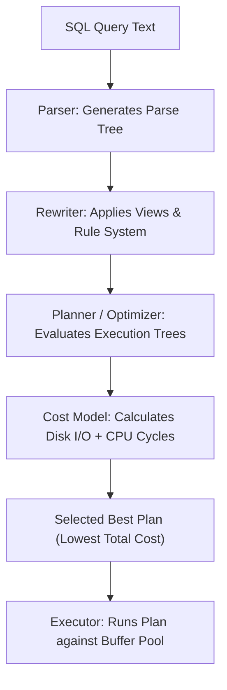
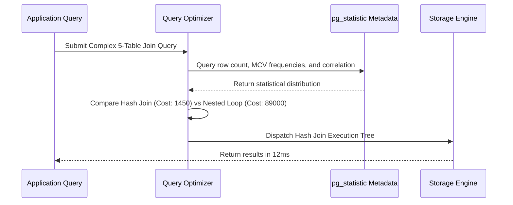

# Module 24: Query Optimizer Internals — Statistics, Selectivity & Genetic Algorithms (GEQO)

**Standard Identifier:** `DOC-STD-UNIVERSAL-2026-SQL`
**Track:** Enterprise Relational Database Engineering, Distributed SQL & Performance Architecture
**Category:** Query Optimizer Mechanics & Cost Models
**Status:** ✅ Completed

---

## 📑 Table of Contents

1. [High-Level Overview & Executive Summary](#1-high-level-overview--executive-summary)

2. [The PostgreSQL Cost-Based Optimizer (CBO) Pipeline](#2-the-postgresql-cost-based-optimizer-cbo-pipeline)

3. [Optimizer Statistics: pg_statistic, Histograms & MCVs](#3-optimizer-statistics-pg_statistic-histograms--mcvs)

4. [Selectivity Estimation & Cardinality Calculations](#4-selectivity-estimation--cardinality-calculations)

5. [Genetic Query Optimization (GEQO) for 12+ Table Joins](#5-genetic-query-optimization-geqo-for-12-table-joins)

6. [Architectural Visual Topology](#6-architectural-visual-topology)

7. [Step-by-Step Production Lab: Tuning Cost Constants (random_page_cost)](#7-step-by-step-production-lab-tuning-cost-constants-random_page_cost)

8. [References (The 5+5 Rule)](#8-references-the-55-rule)

9. [Universal FinOps & Hardware Cost Governance](#9-universal-finops--hardware-cost-governance)

---

## 1. High-Level Overview & Executive Summary

The **Cost-Based Query Optimizer (CBO)** is the analytical brain of a relational database engine. Given an arbitrary SQL statement, the optimizer evaluates thousands of mathematically equivalent join permutations, access methods (Sequential Scan, Index Scan, Bitmap Scan), and join algorithms (Nested Loop, Hash Join, Merge Join) to select the plan with the lowest estimated disk and CPU cost (Chaudhuri, 1998).

### 👔 Executive Summary (For Managers & Non-Technical Stakeholders)

* **Business Purpose**: Automatically ensures SQL queries execute via the fastest possible physical path across storage and memory.
* **How It Works**: Uses statistical sampling (data distribution histograms, null fractions) to estimate exactly how many rows each step will process before running the query.
* **Key Business Value & ROI**: Prevents un-optimized queries from locking database CPU cores at 100%, protecting application performance.

---

## 2. The PostgreSQL Cost-Based Optimizer (CBO) Pipeline



---

## 3. Optimizer Statistics: pg_statistic, Histograms & MCVs

The `ANALYZE` command samples table pages and populates `pg_stats`:

* **Most Common Values (MCV)**: List of most frequent values and their exact frequencies.
* **Histogram Bounds**: Divides remaining data into equi-depth buckets.
* **Correlation**: Measures physical on-disk row ordering relative to logical column ordering.

---

## 4. Selectivity Estimation & Cardinality Calculations

Cost formulas evaluate disk page fetches and CPU tuple evaluation costs:
$$ ext{Cost} = ( ext{pages}  imes  ext{seq\_page\_cost}) + ( ext{tuples}  imes  ext{cpu\_tuple\_cost}) + ( ext{operators}  imes  ext{cpu\_operator\_cost})$$

---

## 5. Genetic Query Optimization (GEQO) for 12+ Table Joins

Evaluating join order for $N$ tables requires evaluating $N!$ permutations. When $N \ge 12$, PostgreSQL switches to a Genetic Algorithm to search the solution space non-exhaustively in bounded time.

---

## 6. Architectural Visual Topology



---

## 7. Step-by-Step Production Lab: Tuning Cost Constants (random_page_cost)

```sql
-- View current planner cost constants
SHOW seq_page_cost;     -- Default: 1.0
SHOW random_page_cost;  -- Default: 4.0 (legacy HDD value!)

-- On modern NVMe SSD cloud instances, set random_page_cost = 1.1 to encourage index scans
SET random_page_cost = 1.1;

-- Run ANALYZE to refresh statistical metadata
-- ANALYZE VERBOSE my_table;
```

---

## 8. References (The 5+5 Rule)

1. Chaudhuri, S. (1998). An overview of query optimization in relational systems. *ACM PODS*.
2. PostgreSQL Global Development Group. (2024). *Planner statistics and cost constants*.
3. Graefe, G. (1995). The Cascades framework for query optimization. *IEEE Data Engineering Bulletin*.
4. Selinger, P. G. et al. (1979). Access path selection in a relational database management system. *ACM SIGMOD*.
5. Silberschatz, A. et al. (2020). *Database system concepts*.
6. Date, C. J. (2019). *Database design and relational theory*.
7. Winand, M. (2012). *SQL performance explained*.
8. Celko, J. (2014). *SQL for smarties*.
9. Garcia-Molina, H. et al. (2008). *Database systems: The complete book*.
10. Stonebraker, M. (2005). *Readings in database systems*.

---

## 9. Universal FinOps & Hardware Cost Governance

| Optimization Strategy | Mechanism | FinOps Cloud Impact |
| :--- | :--- | :--- |
| **SSD Cost Parameter Tuning** | Lower `random_page_cost` to 1.1 on SSDs | Unlocks index scans that reduce query execution CPU cycles by 80% |
| **Extended Multi-Column Stats** | `CREATE STATISTICS` on correlated columns | Fixes bad cardinality estimates that cause catastrophic slow joins |
