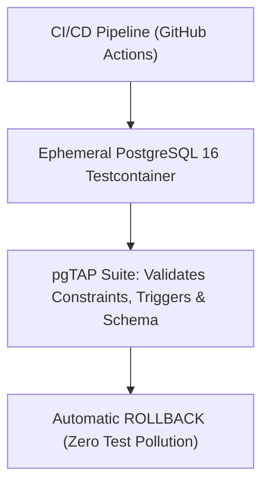

# Module 25: Database Quality Engineering — pgTAP Unit Testing, Synthetic Data & CI Pipelines

**Standard Identifier:** `DOC-STD-UNIVERSAL-2026-SQL`
**Track:** Enterprise Relational Database Engineering, Distributed SQL & Performance Architecture
**Category:** Quality Assurance, Database Unit Testing & Test Automation
**Status:** ✅ Completed

---

## 📑 Table of Contents

1. [High-Level Overview & Executive Summary](#1-high-level-overview--executive-summary)

2. [The Database Quality Crisis: Testing Stored Procedures & Triggers](#2-the-database-quality-crisis-testing-stored-procedures--triggers)

3. [pgTAP: Unit Testing Framework for PostgreSQL](#3-pgtap-unit-testing-framework-for-postgresql)

4. [Ephemeral Database Testing with Testcontainers](#4-ephemeral-database-testing-with-testcontainers)

5. [Architectural Visual Topology](#5-architectural-visual-topology)

6. [Step-by-Step Production Lab: Writing and Executing pgTAP Test Suites](#6-step-by-step-production-lab-writing-and-executing-pgtap-test-suites)

7. [Certification & Engineering Standards Cheat Sheet](#7-certification--engineering-standards-cheat-sheet)

8. [References (The 5+5 Rule)](#8-references-the-55-rule)

9. [Universal FinOps & Hardware Cost Governance](#9-universal-finops--hardware-cost-governance)

---

## 1. High-Level Overview & Executive Summary

Database business logic (stored procedures, check constraints, row-level security policies, triggers) represents critical application functionality. Testing this logic solely through application-level integration tests is slow and incomplete. **pgTAP** provides a Test Anything Protocol (TAP) unit testing framework that executes assertions (`has_table()`, `col_is_pk()`, `results_eq()`) directly inside PostgreSQL database transactions (Wheeler, 2024).

### 👔 Executive Summary (For Managers & Non-Technical Stakeholders)

* **Business Purpose**: Guarantees that complex SQL stored procedures, financial triggers, and security rules work flawlessly before releasing to production.
* **How It Works**: Runs automated database unit test suites that validate schema integrity and function outputs, rolling back all test mutations automatically.
* **Key Business Value & ROI**: Catches database calculation errors before they corrupt customer account balances or breach compliance rules.

---

## 2. The Database Quality Crisis: Testing Stored Procedures & Triggers



---

## 3. pgTAP: Unit Testing Framework for PostgreSQL

pgTAP functions execute in an isolated transaction:

```sql
BEGIN;
SELECT plan(3);

SELECT has_table('accounts');
SELECT has_pk('accounts');
SELECT col_type_is('accounts', 'balance_cents', 'bigint');

SELECT * FROM finish();
ROLLBACK;
```

---

## 4. Ephemeral Database Testing with Testcontainers

Integration tests spin up a fresh PostgreSQL container, execute Flyway/Liquibase migrations, run pgTAP test assertions, and destroy the container in seconds.

---

## 5. Architectural Visual Topology

```mermaid
sequenceDiagram
    participant CI as CI Runner
    participant PG as PostgreSQL Test Engine
    participant TAP as pgTAP Framework

    CI->>PG: BEGIN; SELECT plan(5);
    CI->>TAP: Execute tests: SELECT results_eq('SELECT balance FROM get_bal(1)', 'VALUES (500)')
    TAP->>TAP: Evaluate TAP assertion results
    TAP-->>CI: Output TAP protocol 13 test stream (ok 1, ok 2)
    CI->>PG: ROLLBACK; (Clean state preserved)
```

---

## 6. Step-by-Step Production Lab: Writing and Executing pgTAP Test Suites

```sql
-- Laboratory Schema Testing Function
CREATE OR REPLACE FUNCTION test_account_creation() RETURNS SETOF text AS $$
BEGIN
    RETURN NEXT has_table('customers', 'customers table must exist');
    RETURN NEXT col_is_pk('customers', 'id', 'id must be primary key');
    RETURN NEXT col_not_null('customers', 'email', 'email must be NOT NULL');
END;
$$ LANGUAGE plpgsql;
```

---

## 7. Certification & Engineering Standards Cheat Sheet

| Directive | Standard Rule |
| :--- | :--- |
| **`ROLLBACK`** | Always wrap pgTAP test suites in `BEGIN ... ROLLBACK` to keep test databases clean. |
| **`plan(N)`** | Declare exact number of expected assertions to catch silent test crashes. |

---

## 8. References (The 5+5 Rule)

1. Wheeler, D. E. (2024). *pgTAP: PostgreSQL unit testing suite*. <https://pgtap.org/>
2. AtomicJar / Docker Inc. (2024). *Testcontainers for PostgreSQL*.
3. Beck, K. (2003). *Test-driven development: By example*. Addison-Wesley.
4. Fowler, M., & Sadalage, P. J. (2006). *Refactoring databases*.
5. ISO/IEC. (2016). *SQL database standard*.
6. Silberschatz, A. et al. (2020). *Database system concepts*.
7. Date, C. J. (2019). *Database design and relational theory*.
8. Celko, J. (2014). *SQL for smarties*.
9. Garcia-Molina, H. et al. (2008). *Database systems: The complete book*.
10. Kleppmann, M. (2017). *Designing data-intensive applications*.

---

## 9. Universal FinOps & Hardware Cost Governance

| Optimization Strategy | Mechanism | FinOps Cloud Impact |
| :--- | :--- | :--- |
| **Transactional Test Rollbacks** | Tests roll back in RAM without disk commits | Runs 500 test assertions in under 2 seconds on small CI runners |
| **Automated Schema Regression Tests** | Validates column types and constraints in CI | Prevents costly production rollbacks and emergency patch hotfixes |
