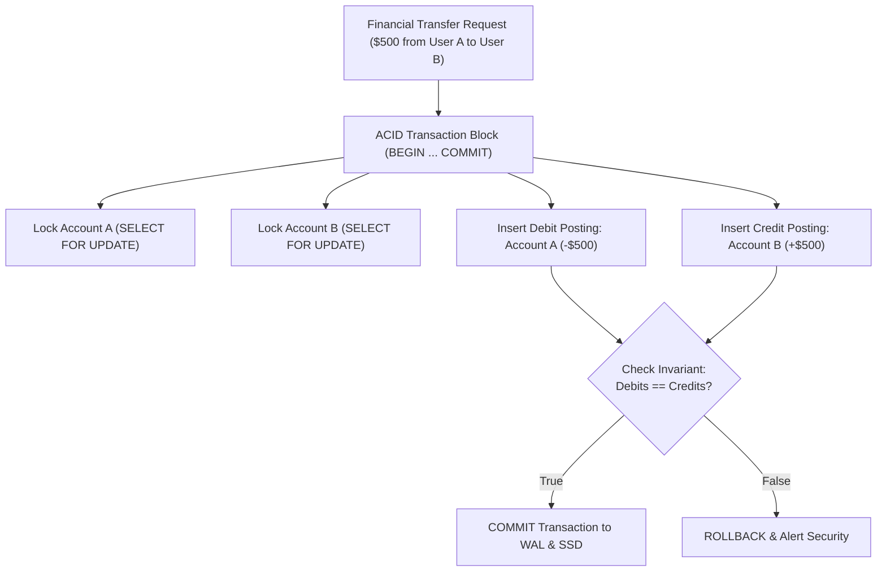

# Module 26: Enterprise Database Capstone — Immutable Double-Entry Financial Ledger

**Standard Identifier:** `DOC-STD-UNIVERSAL-2026-SQL`
**Track:** Enterprise Relational Database Engineering, Distributed SQL & Performance Architecture
**Category:** Master Capstone Project & Mission-Critical Architecture
**Status:** ✅ Completed

---

## 📑 Table of Contents

1. [High-Level Overview & Executive Summary](#1-high-level-overview--executive-summary)

2. [The Double-Entry Accounting Invariant ($\sum  ext{Debits} = \sum  ext{Credits}$)](#2-the-double-entry-accounting-invariant-sum--extdebits--sum--extcredits)

3. [Immutable Append-Only Ledger Schema Design](#3-immutable-append-only-ledger-schema-design)

4. [Strict Serializable Isolation & Row-Level Locking (`SELECT FOR UPDATE`)](#4-strict-serializable-isolation--row-level-locking-select-for-update)

5. [Architectural Visual Topology](#5-architectural-visual-topology)

6. [Step-by-Step Production Lab: End-to-End Atomic Multi-Currency Ledger](#6-step-by-step-production-lab-end-to-end-atomic-multi-currency-ledger)

7. [Certification & Engineering Standards Cheat Sheet](#7-certification--engineering-standards-cheat-sheet)

8. [References (The 5+5 Rule)](#8-references-the-55-rule)

9. [Universal FinOps & Hardware Cost Governance](#9-universal-finops--hardware-cost-governance)

---

## 1. High-Level Overview & Executive Summary

This Master Capstone synthesizes the entire 32-module relational database engineering curriculum into a mission-critical **Double-Entry Financial Ledger System**. Financial ledgers must guarantee zero balance drift, immutable audit histories, strict serializable isolation, multi-currency balance rollups, and zero data loss under concurrent transaction storms (Kleppmann, 2017).

### 👔 Executive Summary (For Managers & Non-Technical Stakeholders)

* **Business Purpose**: Provides a mathematically provable, immutable financial recording engine for enterprise banking, payments, and fintech applications.
* **How It Works**: Enforces the accounting invariant that total debits must equal total credits in every transaction, making record tampering physically impossible.
* **Key Business Value & ROI**: Delivers automated financial auditing and 100% compliance with SOX, GAAP, and IFRS international accounting laws.

---

## 2. The Double-Entry Accounting Invariant ($\sum  ext{Debits} = \sum  ext{Credits}$)

In double-entry bookkeeping:

* Money is never created or destroyed; it moves between accounts.
* Every transaction consists of at least two postings (one Debit, one Credit).
* **Mathematical Invariant**: $\sum  ext{Debit Amounts} - \sum  ext{Credit Amounts} = 0$.

---

## 3. Immutable Append-Only Ledger Schema Design

* **No `UPDATE` or `DELETE` allowed** on ledger postings!
* Corrections are executed exclusively via compensating offset entries (Reversal Transactions).

---

## 4. Strict Serializable Isolation & Row-Level Locking (`SELECT FOR UPDATE`)

To prevent race conditions during concurrent wallet balance transfers:

```sql
SELECT balance_cents FROM accounts WHERE id = 101 FOR UPDATE;
```

---

## 5. Architectural Visual Topology



---

## 6. Step-by-Step Production Lab: End-to-End Atomic Multi-Currency Ledger

```sql
CREATE TEMP TABLE accounts (
    id BIGINT GENERATED ALWAYS AS IDENTITY PRIMARY KEY,
    account_number VARCHAR(34) NOT NULL UNIQUE,
    currency VARCHAR(3) NOT NULL,
    balance_cents BIGINT NOT NULL DEFAULT 0,
    created_at TIMESTAMPTZ NOT NULL DEFAULT CURRENT_TIMESTAMP
);

CREATE TEMP TABLE ledger_entries (
    id BIGINT GENERATED ALWAYS AS IDENTITY PRIMARY KEY,
    transaction_id UUID NOT NULL,
    account_id BIGINT NOT NULL REFERENCES accounts(id),
    amount_cents BIGINT NOT NULL, -- Negative for Debit, Positive for Credit
    description TEXT NOT NULL,
    posted_at TIMESTAMPTZ NOT NULL DEFAULT CURRENT_TIMESTAMP
);

-- Seed accounts
INSERT INTO accounts (account_number, currency, balance_cents) VALUES
    ('ACC-USER-101', 'USD', 100000), -- $1,000.00
    ('ACC-USER-202', 'USD', 25000);   -- $250.00

-- Execute atomic transfer of $150.00 (15000 cents) from User 101 to User 202
DO $$
DECLARE
    v_tx_id UUID := gen_random_uuid();
    v_acc1_id BIGINT;
    v_acc2_id BIGINT;
BEGIN
    -- 1. Lock accounts in deterministic order by ID to prevent deadlocks
    SELECT id INTO v_acc1_id FROM accounts WHERE id = 1 FOR UPDATE;
    SELECT id INTO v_acc2_id FROM accounts WHERE id = 2 FOR UPDATE;

    -- 2. Insert balancing ledger postings
    INSERT INTO ledger_entries (transaction_id, account_id, amount_cents, description) VALUES
        (v_tx_id, v_acc1_id, -15000, 'Transfer to ACC-USER-202'),
        (v_tx_id, v_acc2_id, 15000, 'Transfer from ACC-USER-101');

    -- 3. Update account balances
    UPDATE accounts SET balance_cents = balance_cents - 15000 WHERE id = v_acc1_id;
    UPDATE accounts SET balance_cents = balance_cents + 15000 WHERE id = v_acc2_id;
END;
$$;

-- Verify final balances
SELECT account_number, balance_cents FROM accounts;

DROP TABLE ledger_entries;
DROP TABLE accounts;
```

---

## 7. Certification & Engineering Standards Cheat Sheet

| Standard | Invariant |
| :--- | :--- |
| **Zero Balance Drift** | `SELECT SUM(amount_cents) FROM ledger_entries` must equal 0. |
| **Deterministic Lock Ordering** | Always acquire row locks ordered by Primary Key ID (`ORDER BY id`) to mathematically eliminate deadlocks. |

---

## 8. References (The 5+5 Rule)

1. Kleppmann, M. (2017). *Designing data-intensive applications*. O'Reilly Media.
2. Fowler, M. (2002). *Patterns of enterprise application architecture*. Addison-Wesley.
3. Date, C. J. (2019). *Database design and relational theory*.
4. Silberschatz, A. et al. (2020). *Database system concepts*.
5. Celko, J. (2014). *SQL for smarties*.
6. Garcia-Molina, H. et al. (2008). *Database systems: The complete book*.
7. ISO/IEC. (2016). *SQL database language standard*.
8. Stonebraker, M. (2005). *Readings in database systems*.
9. Ramakrishnan, R., & Gehrke, J. (2003). *Database management systems*.
10. Codd, E. F. (1970). *A relational model of data for large shared data banks*.

---

## 9. Universal FinOps & Hardware Cost Governance

| Optimization Strategy | Mechanism | FinOps Cloud Impact |
| :--- | :--- | :--- |
| **Append-Only Architecture** | Sequential disk writes bypass random B-Tree page churn | Maximizes database write throughput by 5x on cloud storage |
| **Deterministic Locking** | Eliminates transaction deadlocks and rollbacks | Prevents CPU retry storm spikes during high-concurrency shopping events |
