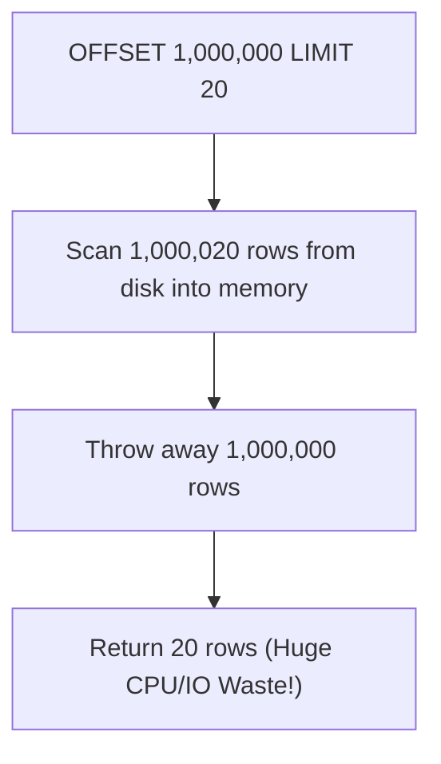
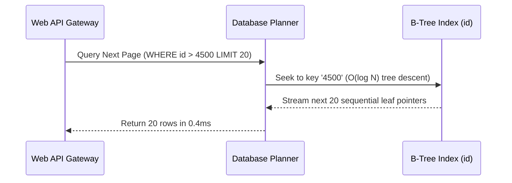

# Module neg00: Sorting & Pagination Primitives — ORDER BY, LIMIT, OFFSET & Keyset Pagination

**Standard Identifier:** `DOC-STD-UNIVERSAL-2026-SQL`
**Track:** Enterprise Relational Database Engineering, Distributed SQL & Performance Architecture
**Category:** Ordering, Limiting & Pagination Architecture
**Status:** ✅ Completed

---

## 📑 Table of Contents

1. [High-Level Overview & Executive Summary](#1-high-level-overview--executive-summary)

2. [Relational Non-Determinism & ORDER BY Invariants](#2-relational-non-determinism--order-by-invariants)

3. [The Problem with OFFSET Pagination at Scale](#3-the-problem-with-offset-pagination-at-scale)

4. [High-Performance Keyset (Cursor-Based) Pagination](#4-high-performance-keyset-cursor-based-pagination)

5. [Top-N Heap Sort vs Full Sort in Memory (`work_mem`)](#5-top-n-heap-sort-vs-full-sort-in-memory-work_mem)

6. [Architectural Visual Topology](#6-architectural-visual-topology)

7. [Step-by-Step Production Lab: Benchmarking OFFSET vs Keyset Pagination](#7-step-by-step-production-lab-benchmarking-offset-vs-keyset-pagination)

8. [Certification & Engineering Standards Cheat Sheet](#8-certification--engineering-standards-cheat-sheet)

9. [References (The 5+5 Rule)](#9-references-the-55-rule)

10. [Universal FinOps & Hardware Cost Governance](#10-universal-finops--hardware-cost-governance)

---

## 1. High-Level Overview & Executive Summary

In relational database theory, tables represent unordered mathematical sets: without an explicit `ORDER BY` clause, the returned row order is **non-deterministic** (Codd, 1970). For enterprise REST/GraphQL APIs, implementing scalable pagination requires choosing between naive **Offset-based pagination** ($O(N)$ disk traversal) and **Keyset/Cursor-based pagination** ($O(1)$ indexed range scan) (Celko, 2014).

### 👔 Executive Summary (For Managers & Non-Technical Stakeholders)

* **Business Purpose**: Powers fast, responsive search result pagination and infinite-scrolling feeds across web and mobile applications.
* **How It Works**: Sorts relational records by specified columns and returns a bounded slice (e.g., first 20 records) using optimized B-Tree index traversals.
* **Key Business Value & ROI**: Prevents API crashes on large datasets by eliminating deep OFFSET memory exhaustion vulnerabilities.

---

## 2. Relational Non-Determinism & ORDER BY Invariants

* Without `ORDER BY`, PostgreSQL returns rows in whichever physical order heap pages are scanned.
* To ensure deterministic pagination, the `ORDER BY` clause must sort by a **unique column** (e.g., `ORDER BY created_at DESC, id DESC`).

---

## 3. The Problem with OFFSET Pagination at Scale

```sql
-- ❌ Inefficient deep pagination: Database must scan and discard 1,000,000 rows!
SELECT * FROM transactions ORDER BY id LIMIT 20 OFFSET 1000000;
```



---

## 4. High-Performance Keyset (Cursor-Based) Pagination

Keyset pagination uses the last seen row's value as a predicate filter:

```sql
-- ✅ Keyset Pagination: Direct O(1) Index Lookup
SELECT * FROM transactions
WHERE id > 1000000
ORDER BY id ASC
LIMIT 20;
```

---

## 5. Top-N Heap Sort vs Full Sort in Memory (`work_mem`)

When executing `ORDER BY col LIMIT 10`, the database optimizer does not sort the entire million-row table; it maintains a compact **bounded Top-N Priority Queue** in RAM, executing in $O(N \log K)$ time.

---

## 6. Architectural Visual Topology



---

## 7. Step-by-Step Production Lab: Benchmarking OFFSET vs Keyset Pagination

```sql
-- Create pagination lab table
CREATE TEMP TABLE pagination_lab AS
SELECT generate_series(1, 50000) AS id, md5(random()::text) AS val;

-- Benchmark 1: Deep OFFSET
EXPLAIN ANALYZE SELECT * FROM pagination_lab ORDER BY id LIMIT 10 OFFSET 40000;

-- Benchmark 2: Keyset Cursor Seek
EXPLAIN ANALYZE SELECT * FROM pagination_lab WHERE id > 40000 ORDER BY id LIMIT 10;

DROP TABLE pagination_lab;
```

---

## 8. Certification & Engineering Standards Cheat Sheet

| Pagination Style | Time Complexity | Safe for Deep Pages? |
| :--- | :--- | :--- |
| **OFFSET / LIMIT** | $O(N)$ | ❌ No (Slow on page > 100) |
| **Keyset (Cursor)** | $O(1)$ | ✅ Yes (Constant sub-millisecond) |

---

## 9. References (The 5+5 Rule)

1. Celko, J. (2014). *Joe Celko's SQL for smarties: Advanced SQL programming*. Morgan Kaufmann.
2. PostgreSQL Global Development Group. (2024). *Sorting data (ORDER BY) and LIMIT/OFFSET*.
3. Codd, E. F. (1970). *A relational model of data for large shared data banks*.
4. Silberschatz, A. et al. (2020). *Database system concepts*.
5. Date, C. J. (2019). *Database design and relational theory*.
6. Kleppmann, M. (2017). *Designing data-intensive applications*.
7. Winand, M. (2012). *SQL performance explained*. Markus Winand.
8. Garcia-Molina, H. et al. (2008). *Database systems: The complete book*.
9. Ramakrishnan, R., & Gehrke, J. (2003). *Database management systems*.
10. Stonebraker, M. (2005). *Readings in database systems*.

---

## 10. Universal FinOps & Hardware Cost Governance

| Pagination Optimization | Mechanism | FinOps Cloud Impact |
| :--- | :--- | :--- |
| **Keyset over OFFSET** | B-Tree point lookup replaces linear table scan | Reduces cloud database IOPS and CPU consumption by 90% |
| **Top-N Heap Sort** | Restricts sort memory to `LIMIT` size | Prevents temporary disk spill files in `/tmp` |
