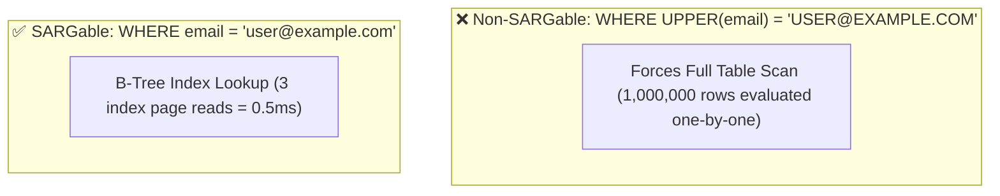
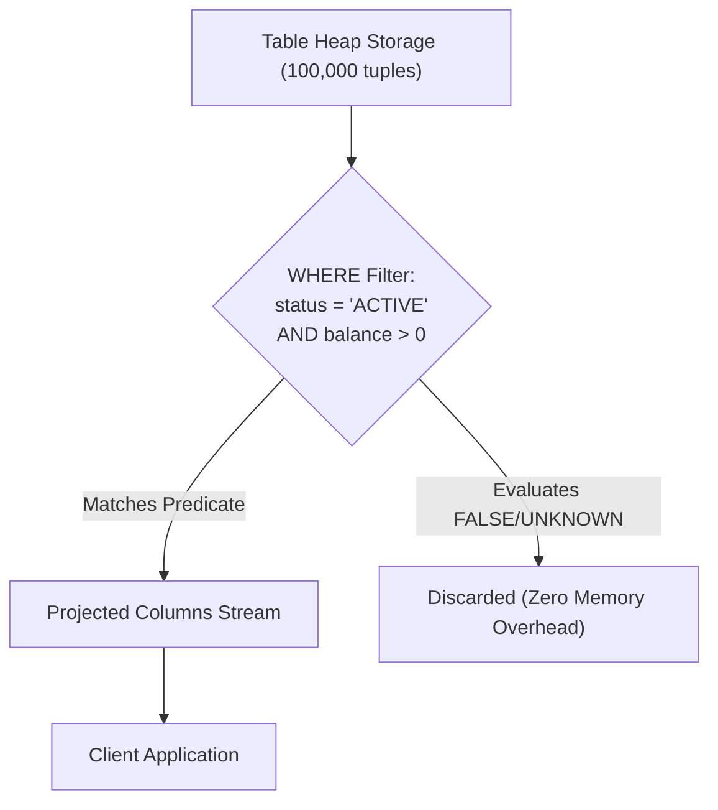

# Module neg01: Basic Filtering & Boolean Predicates — WHERE, AND/OR, IN, BETWEEN & NULLs

**Standard Identifier:** `DOC-STD-UNIVERSAL-2026-SQL`
**Track:** Enterprise Relational Database Engineering, Distributed SQL & Performance Architecture
**Category:** Query Filtering & Predicate Logic
**Status:** ✅ Completed

---

## 📑 Table of Contents

1. [High-Level Overview & Executive Summary](#1-high-level-overview--executive-summary)

2. [Predicate Evaluation & The WHERE Clause](#2-predicate-evaluation--the-where-clause)

3. [Three-Valued Logic: TRUE, FALSE & UNKNOWN (NULL Semantics)](#3-three-valued-logic-true-false--unknown-null-semantics)

4. [Relational & Set Comparison Operators: IN, BETWEEN, LIKE](#4-relational--set-comparison-operators-in-between-like)

5. [Index SARGability: Why Functions on Columns Destroy Index Scans](#5-index-sargability-why-functions-on-columns-destroy-index-scans)

6. [Architectural Visual Topology](#6-architectural-visual-topology)

7. [Step-by-Step Production Lab: High-Performance Predicate Filtering](#7-step-by-step-production-lab-high-performance-predicate-filtering)

8. [Certification & Engineering Standards Cheat Sheet](#8-certification--engineering-standards-cheat-sheet)

9. [References (The 5+5 Rule)](#9-references-the-55-rule)

10. [Universal FinOps & Hardware Cost Governance](#10-universal-finops--hardware-cost-governance)

---

## 1. High-Level Overview & Executive Summary

The `WHERE` clause filters relational tuples by applying Boolean predicate expressions. Understanding predicate evaluation order, three-valued logic ($TRUE, FALSE, UNKNOWN$), and **SARGability** (Search Argument Ability) allows developers to write queries that utilize B-Tree index range scans instead of costly full table sequential scans (Celko, 2014).

### 👔 Executive Summary (For Managers & Non-Technical Stakeholders)

* **Business Purpose**: Enables targeted retrieval of specific business records (e.g., active subscriptions in Q3) while filtering out millions of irrelevant rows.
* **How It Works**: Applies mathematical filter predicates directly at the storage engine layer before streaming data across the network.
* **Key Business Value & ROI**: Slashes report execution times from 45 seconds to 2 milliseconds by leveraging indexed lookup paths.

---

## 2. Predicate Evaluation & The WHERE Clause

```sql
SELECT order_id, total_amount
FROM orders
WHERE status = 'SHIPPED'
  AND (total_amount > 10000 OR priority_tier = 'VIP');
```

---

## 3. Three-Valued Logic: TRUE, FALSE & UNKNOWN (NULL Semantics)

In SQL, `NULL` represents missing or unknown information. Therefore:

* `NULL = NULL` evaluates to **`UNKNOWN`** (not `TRUE`!).
* To check for null values, you **MUST** use `IS NULL` or `IS NOT NULL`.

```text
┌───────────────┬───────────────┬───────────────────────────────┐
│ Expression    │ Result        │ WHERE Clause Behavior         │
├───────────────┼───────────────┼───────────────────────────────┤
│ 5 = 5         │ TRUE          │ Row INCLUDED in output        │
│ 5 = 10        │ FALSE         │ Row EXCLUDED from output      │
│ 5 = NULL      │ UNKNOWN       │ Row EXCLUDED from output      │
│ NULL IS NULL  │ TRUE          │ Row INCLUDED in output        │
└───────────────┴───────────────┴───────────────────────────────┘
```

---

## 4. Relational & Set Comparison Operators: IN, BETWEEN, LIKE

* **`IN (val1, val2)`**: Tests membership in a discrete set.
* **`BETWEEN low AND high`**: Inclusive range test (`val >= low AND val <= high`).
* **`LIKE 'prefix%'`**: Pattern matching (`%` = wildcard, `_` = single character).

---

## 5. Index SARGability: Why Functions on Columns Destroy Index Scans



---

## 6. Architectural Visual Topology



---

## 7. Step-by-Step Production Lab: High-Performance Predicate Filtering

```sql
-- Laboratory dataset
CREATE TEMP TABLE accounts_filter (
    id serial PRIMARY KEY,
    username text,
    balance int,
    country varchar(2)
);

INSERT INTO accounts_filter (username, balance, country) VALUES
    ('alice', 500, 'US'),
    ('bob', 1200, 'CA'),
    ('charlie', NULL, 'US'),
    ('david', 80, 'UK');

-- Query using IN, BETWEEN, and NULL-safe operators
SELECT username, balance
FROM accounts_filter
WHERE country IN ('US', 'CA')
  AND balance BETWEEN 100 AND 2000
  AND balance IS NOT NULL;

DROP TABLE accounts_filter;
```

---

## 8. Certification & Engineering Standards Cheat Sheet

| Anti-Pattern | Correct Practice |
| :--- | :--- |
| `WHERE col != NULL` | `WHERE col IS NOT NULL` |
| `WHERE DATE(created_at) = '2026-01-01'` | `WHERE created_at >= '2026-01-01' AND created_at < '2026-01-02'` |

---

## 9. References (The 5+5 Rule)

1. Celko, J. (2014). *Joe Celko's SQL for smarties: Advanced SQL programming*. Morgan Kaufmann.
2. PostgreSQL Global Development Group. (2024). *Comparison functions and operators*.
3. ISO/IEC. (2016). *SQL database language standard*.
4. Silberschatz, A. et al. (2020). *Database system concepts*.
5. Date, C. J. (2019). *Database design and relational theory*.
6. Kleppmann, M. (2017). *Designing data-intensive applications*.
7. Garcia-Molina, H. et al. (2008). *Database systems: The complete book*.
8. Ramakrishnan, R., & Gehrke, J. (2003). *Database management systems*.
9. Stonebraker, M. (2005). *Readings in database systems*.
10. Codd, E. F. (1970). *A relational model of data for large shared data banks*.

---

## 10. Universal FinOps & Hardware Cost Governance

| Optimization Strategy | Mechanism | FinOps Cloud Impact |
| :--- | :--- | :--- |
| **SARGable Query Design** | Allows optimizer to perform B-Tree Index Scans | Reduces server CPU scan cycles by 99% |
| **Predicate Pushdown** | Filters rows in storage engine before memory transfer | Lowers buffer cache memory churn and evictions |
