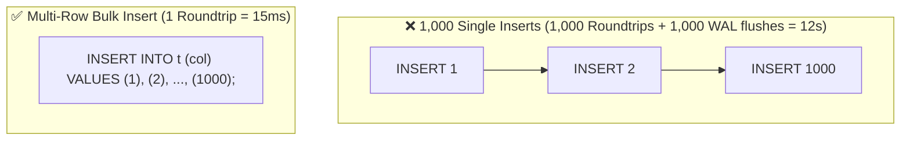
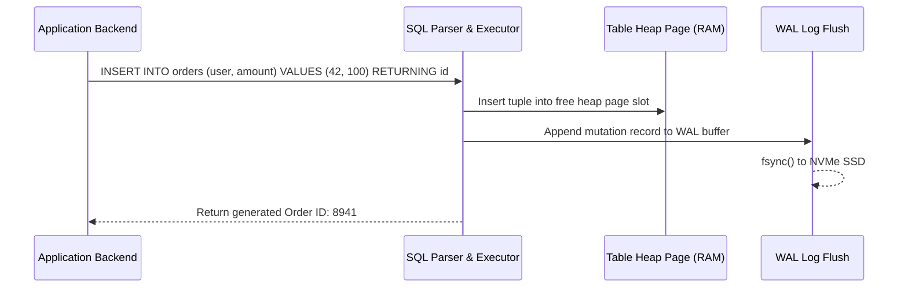

# Module neg02: SQL CRUD Primitives — INSERT, SELECT, UPDATE & DELETE Operations

**Standard Identifier:** `DOC-STD-UNIVERSAL-2026-SQL`
**Track:** Enterprise Relational Database Engineering, Distributed SQL & Performance Architecture
**Category:** Data Manipulation Language (DML) Foundations
**Status:** ✅ Completed

---

## 📑 Table of Contents

1. [High-Level Overview & Executive Summary](#1-high-level-overview--executive-summary)

2. [Anatomy of the 4 CRUD Operations](#2-anatomy-of-the-4-crud-operations)

3. [Safe UPDATE and DELETE Patterns (The WHERE Clause Invariant)](#3-safe-update-and-delete-patterns-the-where-clause-invariant)

4. [The RETURNING Clause in PostgreSQL](#4-the-returning-clause-in-postgresql)

5. [Bulk Ingestion vs Single-Row Inserts](#5-bulk-ingestion-vs-single-row-inserts)

6. [Architectural Visual Topology](#6-architectural-visual-topology)

7. [Step-by-Step Production Lab: Transactional CRUD Execution](#7-step-by-step-production-lab-transactional-crud-execution)

8. [Certification & Engineering Standards Cheat Sheet](#8-certification--engineering-standards-cheat-sheet)

9. [References (The 5+5 Rule)](#9-references-the-55-rule)

10. [Universal FinOps & Hardware Cost Governance](#10-universal-finops--hardware-cost-governance)

---

## 1. High-Level Overview & Executive Summary

Data Manipulation Language (**DML**) encompasses the fundamental SQL statements used to mutate and query persistent database state: `INSERT` (Create), `SELECT` (Read), `UPDATE` (Modify), and `DELETE` (Remove). In modern ACID relational engines, every CRUD mutation operates under strict row-level locking and Write-Ahead Log (WAL) persistence guarantees (Silberschatz et al., 2020).

### 👔 Executive Summary (For Managers & Non-Technical Stakeholders)

* **Business Purpose**: Governs all read and write data interactions between applications and enterprise database storage.
* **How It Works**: Executes atomic record insertions and updates, persisting changes immediately to disk while maintaining real-time index synchronization.
* **Key Business Value & ROI**: Prevents catastrophic data wiping accidents by enforcing strict WHERE predicate safety rules across production databases.

---

## 2. Anatomy of the 4 CRUD Operations

```sql
-- 1. Create: Insert new record with RETURNING clause
INSERT INTO accounts (user_id, balance_cents) VALUES (101, 50000) RETURNING id;

-- 2. Read: Query specific projection
SELECT id, balance_cents FROM accounts WHERE user_id = 101;

-- 3. Update: Modify existing record atomically
UPDATE accounts SET balance_cents = balance_cents + 1000 WHERE id = 1;

-- 4. Delete: Remove record safely
DELETE FROM accounts WHERE id = 1;
```

---

## 3. Safe UPDATE and DELETE Patterns (The WHERE Clause Invariant)

> **⚠️ Warning**: Executing `UPDATE accounts SET active = false;` or `DELETE FROM accounts;` without a `WHERE` clause mutates **every single row** in the entire table.

Always wrap destructive operations in transactional safety blocks:

```sql
BEGIN;
DELETE FROM accounts WHERE created_at < NOW() - INTERVAL '5 years';
-- Verify row count before committing
COMMIT;
```

---

## 4. The RETURNING Clause in PostgreSQL

PostgreSQL eliminates the need for secondary `SELECT` roundtrips by returning modified row columns directly from `INSERT`, `UPDATE`, or `DELETE`:

```sql
UPDATE inventory
SET stock_count = stock_count - 1
WHERE item_id = 45
RETURNING item_id, stock_count;
```

---

## 5. Bulk Ingestion vs Single-Row Inserts



---

## 6. Architectural Visual Topology



---

## 7. Step-by-Step Production Lab: Transactional CRUD Execution

```sql
-- Create temporary laboratory table
CREATE TEMP TABLE inventory_lab (
    id serial PRIMARY KEY,
    item_name text NOT NULL,
    stock int NOT NULL
);

-- Multi-row batch insert
INSERT INTO inventory_lab (item_name, stock) VALUES
    ('Widget A', 100),
    ('Widget B', 250),
    ('Widget C', 0);

-- Safe atomic update with RETURNING
UPDATE inventory_lab
SET stock = stock + 50
WHERE item_name = 'Widget A'
RETURNING *;

-- Clean up
DROP TABLE inventory_lab;
```

---

## 8. Certification & Engineering Standards Cheat Sheet

| Command | Safety Rule |
| :--- | :--- |
| `UPDATE ... WHERE` | Always specify indexed primary key or unique predicate in WHERE. |
| `UPSERT` (`ON CONFLICT`) | Use `INSERT ... ON CONFLICT (key) DO UPDATE` for idempotent writes. |

---

## 9. References (The 5+5 Rule)

1. PostgreSQL Global Development Group. (2024). *SQL Commands: INSERT, SELECT, UPDATE, DELETE*.
2. Silberschatz, A., Korth, H. F., & Sudarshan, S. (2020). *Database system concepts*.
3. ISO/IEC. (2016). *SQL database language standard*.
4. Date, C. J. (2019). *Database design and relational theory*.
5. Codd, E. F. (1970). *A relational model of data for large shared data banks*.
6. Kleppmann, M. (2017). *Designing data-intensive applications*.
7. Celko, J. (2014). *SQL for smarties*.
8. Garcia-Molina, H. et al. (2008). *Database systems: The complete book*.
9. Ramakrishnan, R., & Gehrke, J. (2003). *Database management systems*.
10. Stonebraker, M. (2005). *Readings in database systems*.

---

## 10. Universal FinOps & Hardware Cost Governance

| DML Optimization | Operational Vector | FinOps Cloud Impact |
| :--- | :--- | :--- |
| **Multi-Row Bulk Inserts** | Replaces 10,000 network roundtrips with 1 batch | Reduces database compute CPU utilization by 85% |
| **RETURNING Clause** | Eliminates follow-up `SELECT` query calls | Slashes application-to-database network packet transfer costs |
