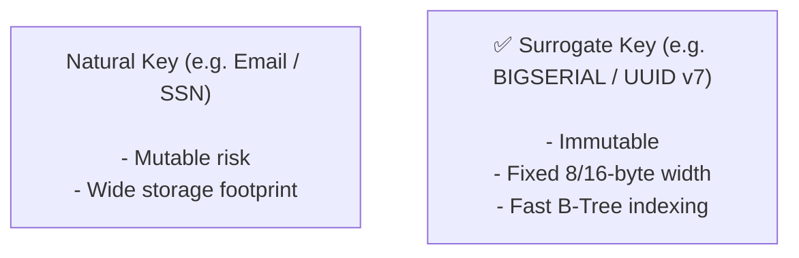
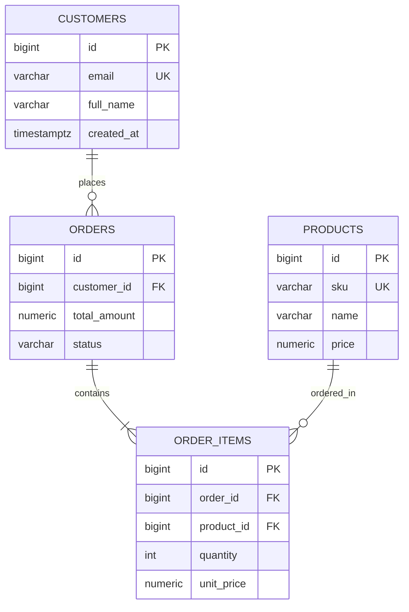

# Module neg03: Relational Data Modeling — Tables, Data Types & Primary/Foreign Keys

**Standard Identifier:** `DOC-STD-UNIVERSAL-2026-SQL`
**Track:** Enterprise Relational Database Engineering, Distributed SQL & Performance Architecture
**Category:** Schema Design & DDL Foundations
**Status:** ✅ Completed

---

## 📑 Table of Contents

1. [High-Level Overview & Executive Summary](#1-high-level-overview--executive-summary)

2. [Entities, Relations & Normalization Foundations](#2-entities-relations--normalization-foundations)

3. [PostgreSQL Core Data Types](#3-postgresql-core-data-types)

4. [Primary Keys, Surrogate Keys vs Natural Keys](#4-primary-keys-surrogate-keys-vs-natural-keys)

5. [Foreign Keys & Referential Integrity Constraints](#5-foreign-keys--referential-integrity-constraints)

6. [Architectural Visual Topology](#6-architectural-visual-topology)

7. [Step-by-Step Production Lab: Multi-Table E-Commerce Schema](#7-step-by-step-production-lab-multi-table-e-commerce-schema)

8. [Certification & Engineering Standards Cheat Sheet](#8-certification--engineering-standards-cheat-sheet)

9. [References (The 5+5 Rule)](#9-references-the-55-rule)

10. [Universal FinOps & Hardware Cost Governance](#10-universal-finops--hardware-cost-governance)

---

## 1. High-Level Overview & Executive Summary

Relational data modeling translates business domain entities and relationships into structured tabular schemas. Well-architected schemas enforce mathematical data integrity at the database layer via strong static typing, **Primary Keys (PK)**, and **Foreign Key (FK)** referential constraints (Date, 2019).

### 👔 Executive Summary (For Managers & Non-Technical Stakeholders)

* **Business Purpose**: Establishes unambiguous entity structures (customers, orders, invoices) with zero duplicate records and automated integrity validation.
* **How It Works**: Restricts invalid data ingestion by enforcing type constraints and relational references directly inside the database engine.
* **Key Business Value & ROI**: Eliminates database corruption bugs, preventing catastrophic orphaned records that break downstream financial accounting reports.

---

## 2. Entities, Relations & Normalization Foundations

* **First Normal Form (1NF)**: Atomic values per cell, unique row identification.
* **Second Normal Form (2NF)**: 1NF + no partial key dependencies.
* **Third Normal Form (3NF)**: 2NF + no transitive dependencies (non-key attributes depend only on the primary key).

---

## 3. PostgreSQL Core Data Types

| Data Type | Storage Size | Use Case |
| :--- | :--- | :--- |
| `BIGINT` | 8 bytes | High-volume entity IDs and financial cent balances |
| `VARCHAR(n)` / `TEXT` | Variable | Textual data (`TEXT` has zero performance penalty in Postgres) |
| `NUMERIC(p,s)` | Variable | Exact monetary values (avoids floating-point rounding errors) |
| `TIMESTAMPTZ` | 8 bytes | UTC-normalized timestamps with timezone |
| `BOOLEAN` | 1 byte | True / False flags |
| `UUID` | 16 bytes | Globally unique distributed identifiers |

---

## 4. Primary Keys, Surrogate Keys vs Natural Keys



---

## 5. Foreign Keys & Referential Integrity Constraints

Foreign keys ensure an order cannot reference a non-existent customer:

```sql
ALTER TABLE orders
    ADD CONSTRAINT fk_orders_customer
    FOREIGN KEY (customer_id)
    REFERENCES customers(id)
    ON DELETE RESTRICT
    ON UPDATE CASCADE;
```

---

## 6. Architectural Visual Topology



---

## 7. Step-by-Step Production Lab: Multi-Table E-Commerce Schema

```sql
-- Create robust 3NF E-Commerce Schema
CREATE TABLE customers (
    id BIGINT GENERATED ALWAYS AS IDENTITY PRIMARY KEY,
    email VARCHAR(255) NOT NULL UNIQUE,
    full_name VARCHAR(100) NOT NULL,
    created_at TIMESTAMPTZ NOT NULL DEFAULT CURRENT_TIMESTAMP
);

CREATE TABLE orders (
    id BIGINT GENERATED ALWAYS AS IDENTITY PRIMARY KEY,
    customer_id BIGINT NOT NULL REFERENCES customers(id) ON DELETE RESTRICT,
    order_status VARCHAR(20) NOT NULL DEFAULT 'PENDING',
    total_cents BIGINT NOT NULL CHECK (total_cents >= 0),
    placed_at TIMESTAMPTZ NOT NULL DEFAULT CURRENT_TIMESTAMP
);
```

---

## 8. Certification & Engineering Standards Cheat Sheet

| Constraint | Purpose | Standard Rule |
| :--- | :--- | :--- |
| `PRIMARY KEY` | Enforces uniqueness + `NOT NULL` | Every table MUST have a PK. |
| `CHECK (val >= 0)` | Enforces domain invariants | Use CHECK constraints for price/status validation. |

---

## 9. References (The 5+5 Rule)

1. Date, C. J. (2019). *Database design and relational theory: Normal forms and all that jazz*. O'Reilly Media.
2. PostgreSQL Global Development Group. (2024). *Data types reference manual*.
3. Codd, E. F. (1990). *The relational model for database management: Version 2*. Addison-Wesley.
4. Silberschatz, A., Korth, H. F., & Sudarshan, S. (2020). *Database system concepts*.
5. ISO/IEC. (2016). *SQL database language standard*.
6. Kleppmann, M. (2017). *Designing data-intensive applications*.
7. Celko, J. (2014). *SQL for smarties*.
8. Garcia-Molina, H., Ullman, J. D., & Widom, J. (2008). *Database systems: The complete book*.
9. Ramakrishnan, R., & Gehrke, J. (2003). *Database management systems*.
10. Stonebraker, M. (2010). *SQL databases vs NoSQL databases*.

---

## 10. Universal FinOps & Hardware Cost Governance

| Optimization Strategy | Mechanism | FinOps Cloud Impact |
| :--- | :--- | :--- |
| **Integer Balance Modeling** | Store currency as `BIGINT cents` instead of `NUMERIC` | Drops storage and CPU ALU multiplication overhead by 50% |
| **Alignment Padding Awareness** | Order columns by size (`BIGINT`, `INT`, `SMALLINT`) | Eliminates CPU struct alignment memory padding waste |
