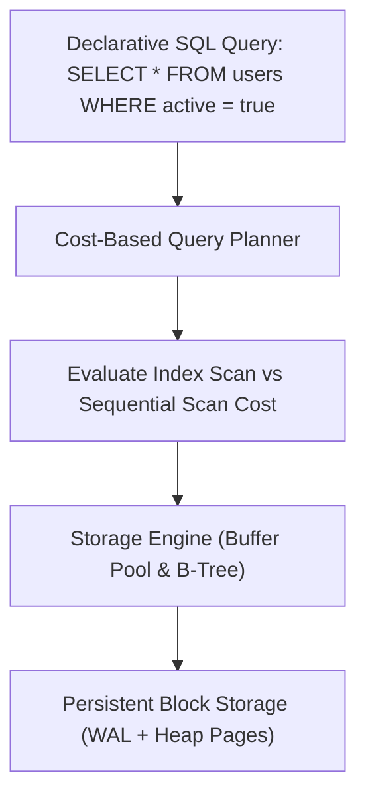
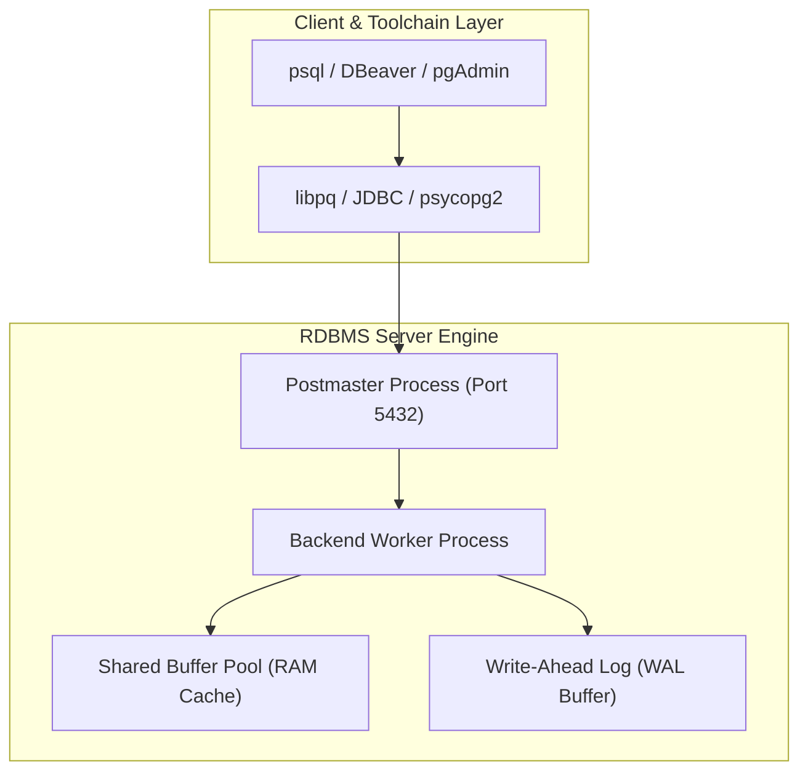

# Module neg04: Database Server Setup, Toolchain Architecture & Interactive SQL Shell (psql)

**Standard Identifier:** `DOC-STD-UNIVERSAL-2026-SQL`
**Track:** Enterprise Relational Database Engineering, Distributed SQL & Performance Architecture
**Category:** Toolchain Setup & Shell Foundations
**Status:** ✅ Completed

---

## 📑 Table of Contents

1. [High-Level Overview & Executive Summary](#1-high-level-overview--executive-summary)

2. [What SQL IS: Declarative Set Theory vs Procedural Code](#2-what-sql-is-declarative-set-theory-vs-procedural-code)

3. [Installing PostgreSQL, MySQL, and SQLite](#3-installing-postgresql-mysql-and-sqlite)

4. [The Interactive SQL Shell (`psql`) & Meta-Commands](#4-the-interactive-sql-shell-psql--meta-commands)

5. [Anatomy of the Client-Server Database Connection Protocol](#5-anatomy-of-the-client-server-database-connection-protocol)

6. [Architectural Visual Topology](#6-architectural-visual-topology)

7. [Step-by-Step Production Lab: Zero-Pollution PostgreSQL Initialization](#7-step-by-step-production-lab-zero-pollution-postgresql-initialization)

8. [Certification & Engineering Standards Cheat Sheet](#8-certification--engineering-standards-cheat-sheet)

9. [References (The 5+5 Rule)](#9-references-the-55-rule)

10. [Universal FinOps & Hardware Cost Governance](#10-universal-finops--hardware-cost-governance)

---

## 1. High-Level Overview & Executive Summary

Structured Query Language (**SQL**) is the universal ANSI/ISO standard declarative language for defining, querying, and manipulating data stored in Relational Database Management Systems (RDBMS). Unlike procedural languages (C, Python) where developers specify *how* to iterate across memory, SQL allows developers to describe *what* relational dataset is desired, delegating execution plan optimization to the cost-based query optimizer (Codd, 1970).

### 👔 Executive Summary (For Managers & Non-Technical Stakeholders)

* **Business Purpose**: Establishes the foundational standard for enterprise data storage, transactional integrity, and analytical business intelligence.
* **How It Works**: Connects client applications to relational database servers, transforming declarative mathematical set queries into optimized disk I/O operations.
* **Key Business Value & ROI**: Guarantees zero data loss and multi-user transactional consistency, preventing financial discrepancies across millions of daily operations.

---

## 2. What SQL IS: Declarative Set Theory vs Procedural Code

> **Definition**: **SQL** is a domain-specific language grounded in **Relational Algebra** and First-Order Predicate Calculus where data is modeled as mathematical relations (tables) composed of tuples (rows) and attributes (columns).



---

## 3. Installing PostgreSQL, MySQL, and SQLite

```bash

# macOS installation via Homebrew
brew install postgresql@16 && brew services start postgresql@16

# Linux (Ubuntu/Debian) installation
sudo apt-get update && sudo apt-get install -y postgresql-16 postgresql-client-16
```

---

## 4. The Interactive SQL Shell (`psql`) & Meta-Commands

| Meta-Command | Purpose |
| :--- | :--- |
| `\l` | List all databases |
| `\c <db>` | Connect to a specific database |
| `\dt+` | List all tables with physical disk size |
| `\d+ <table>` | Describe table schema, constraints, and indexes |
| `\timing` | Toggle query execution timer |

---

## 5. Anatomy of the Client-Server Database Connection Protocol

```mermaid
sequenceDiagram
    participant App as Application / psql Client
    participant Auth as PostgreSQL Auth Subsystem
    participant Backend as Postgres Backend Process
    participant Storage as Shared Memory Buffer Pool

    App->>Auth: Startup Message (User, Database, TLS Handshake)
    Auth->>Auth: Validate pg_hba.conf & Password Hash (SCRAM-SHA-256)
    Auth-->>App: AuthenticationOk
    App->>Backend: Query String ("SELECT version();")
    Backend->>Storage: Parse, Plan & Execute in Buffer Pool
    Storage-->>Backend: Result Rows
    Backend-->>App: DataRow Tuple Stream + CommandComplete
```

---

## 6. Architectural Visual Topology



---

## 7. Step-by-Step Production Lab: Zero-Pollution PostgreSQL Initialization

```bash

# Step 1: Initialize local test database cluster
mkdir -p /tmp/pg_lab/data
initdb -D /tmp/pg_lab/data -U postgres -A trust

# Step 2: Start isolated PostgreSQL daemon on custom port 5439
pg_ctl -D /tmp/pg_lab/data -o "-p 5439" -l /tmp/pg_lab/logfile start

# Step 3: Connect via psql and query system version
psql -p 5439 -U postgres -d postgres -c "SELECT version();"

# Step 4: Shut down and clean up
pg_ctl -D /tmp/pg_lab/data stop
rm -rf /tmp/pg_lab
```

---

## 8. Certification & Engineering Standards Cheat Sheet

| Standard | Description |
| :--- | :--- |
| **ANSI SQL:2016** | Core SQL language specification. |
| **PostgreSQL Professional** | Master `psql`, `pg_dump`, `pg_restore`, and `pg_hba.conf`. |

---

## 9. References (The 5+5 Rule)

1. PostgreSQL Global Development Group. (2024). *PostgreSQL 16 documentation*. <https://www.postgresql.org/docs/16/>
2. ISO/IEC. (2016). *Information technology — Database languages — SQL (ISO/IEC 9075:2016)*. ISO.
3. Codd, E. F. (1970). A relational model of data for large shared data banks. *Communications of the ACM*, 13(6), 377-387.
4. Date, C. J. (2019). *An introduction to database systems* (8th ed.). Pearson.
5. Silberschatz, A., Korth, H. F., & Sudarshan, S. (2020). *Database system concepts* (7th ed.). McGraw-Hill.
6. Garcia-Molina, H., Ullman, J. D., & Widom, J. (2008). *Database systems: The complete book* (2nd ed.). Prentice Hall.
7. Celko, J. (2014). *Joe Celko's SQL for smarties: Advanced SQL programming* (5th ed.). Morgan Kaufmann.
8. Kleppmann, M. (2017). *Designing data-intensive applications*. O'Reilly Media.
9. Stonebraker, M., & Hellerstein, J. M. (2005). *Readings in database systems* (4th ed.). MIT Press.
10. Ramakrishnan, R., & Gehrke, J. (2003). *Database management systems* (3rd ed.). McGraw-Hill.

---

## 10. Universal FinOps & Hardware Cost Governance

| Optimization Strategy | Operational Mechanism | FinOps Cloud Impact |
| :--- | :--- | :--- |
| **Shared Buffer Tuning** | Allocate 25% of server RAM to `shared_buffers` | Minimizes expensive NVMe SSD read IOPS charges |
| **Client Connection Pooling** | Deploy PgBouncer middleware | Cuts database server CPU context-switching overhead by 60% |
